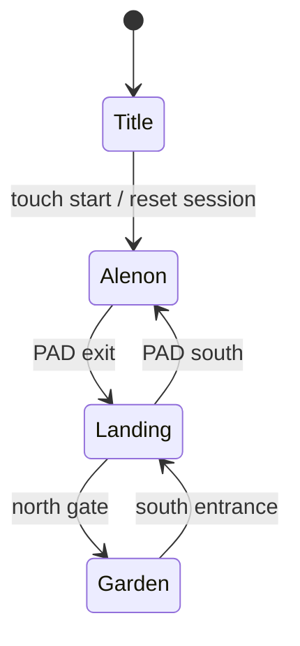
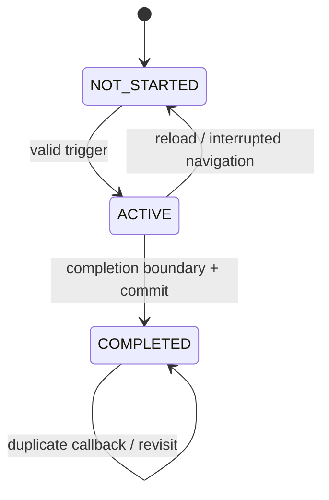

# TAROT BREAKER — Progress / Route / Save Contract (Phase 2A-1)

Status: **READY FOR IMPLEMENTATION of Phase 2A-2, subject to the explicit integration gates in §§6, 27–29.** Product decisions P1–P6 are resolved in §29. This document does not implement a save or authorize Phase 2A-2 within this PR. All `PROPOSED CONTRACT` statements describe the target, not shipped behavior. `FACT` and `CURRENT BEHAVIOR` refer only to the source at the pinned commit; no device gameplay was performed.

## 1. Baseline / Current HEAD

| Item | Value |
| --- | --- |
| Repository / branch | `reverse-shion/tarot-breaker-game` / `main` |
| CURRENT MAIN HEAD verified by GitHub comparison and fresh clone | `3f58bb417fb70a329700add0148b2932f8bd1e2e` |
| Phase 1A audit baseline | `3f58bb417fb70a329700add0148b2932f8bd1e2e` |
| Difference / relevant changes since audit | **NONE**; GitHub comparison reports identical commits and zero changed files |
| Working scope | Three playable scenes in `alenon.html`, `star-country-landing.html`, `index.html` (garden); title also lives in `index.html` |

## 2. Evidence and Scope

**FACT:** The route calls appear at [game.js L1651–1680](../../game.js#L1651-L1680), [alenon.html L2104–2109](../../alenon.html#L2104-L2109), [alenon.html L3028–3056](../../alenon.html#L3028-L3056), [alenon.html L3918–3933](../../alenon.html#L3918-L3933), [star-country-landing.html L887–1019](../../star-country-landing.html#L887-L1019), [star-country-landing.html L2225–2373](../../star-country-landing.html#L2225-L2373), [game.js L663–683](../../game.js#L663-L683). Event ownership appears in [dialogue.js L26–end](../../dialogue.js), [story-event-guard.js](../../story-event-guard.js), and the inline scripts of both maps. Storage appears in [map-journey.js](../../map-journey.js), [audio.js](../../audio.js) and the editor code noted below. Existing source-level tests in `tests/map-roundtrip.test.cjs` and `tests/garden-arrival.test.cjs` are corroboration, **not** a device playthrough; some test expectations reflect older dialogue and cannot establish current product intent.

**RISK:** `?from=` is user-editable, `TarotJourney` is tab-scoped, and the same session object mixes historical completion with companion position. A fabricated URL can currently bypass Alenon's prologue. A browser or tab loss can erase progress. A saved checkpoint that disagrees with event history could start a player in the middle of a mandatory scene.

**PROPOSED CONTRACT:** One validated, versioned progress record is the authority for historical facts and a safe checkpoint; a single-use handoff describes only the next navigation. Runtime, settings, and editor data remain separate. Every route and event listed below is an explicit registry entry. No story lines, choreography, audio, collision, visuals, movement, or present routing are altered by this design document.

Evidence vocabulary throughout: **FACT** = source observation; **CURRENT BEHAVIOR** = behavior directly implied by source; **RISK** = possible failure; **PROPOSED CONTRACT** = future target; **UNRESOLVED PRODUCT DECISION** = owner choice. Proposed map and event IDs are not claims that these IDs already exist.

## 3. Current Playable Route

**FACT / CURRENT BEHAVIOR:** `index.html` has two modes: title without `?from=landing`, and garden with it. Query strings in this table are literal strings in current source, not authorization to enter those scenes. Spawn descriptions distinguish authored positions from positions found after collision loading.

| From → to | File / query | Trigger and arrival | First visit / revisit and dependencies |
| --- | --- | --- | --- |
| TITLE → ALENON | `index.html` → `alenon.html?from=title&build=6bc2a38e` | `TOUCH TO START` invokes `begin()`, resets `TarotJourney`, and redirects; Alenon initial Shion `(716,330)` and automatically starts prologue | Each title start clears tab progress, including prior garden and landing flags. No durable save. |
| ALENON → LANDING | `alenon.html` → `star-country-landing.html?from=alenon` | Complete prologue, board PAD, fly past exit; landing enters PAD arrival animation near `(PAD_HOME.x, PAD_HOME.y)` then dismounts at `PAD_HOME.y − dismountOffsetY` | `story.completed` is local only; outbound does not write a historical event flag. Arrival from Alenon is selected by URL. Waiting Shiopon can be restored from session on later trips. |
| LANDING → GARDEN | `star-country-landing.html` → `index.html?from=landing` | Walk north through central gate; resonance/light and ~1.8 s timer precede navigation. Garden `begin()` places Shion at nearest walkable point to `(724,999)` (nominal default `(724,1015)` minus 16) | `landingMemoryDone` suppresses the Devil memory on revisit if tab state survives. Garden's `shioponMeet`, then `lumiereGate` depend on `gardenStory` flags, not on the URL's authenticity. |
| GARDEN → LANDING | `index.html` → `star-country-landing.html?from=garden` | Walk south through central entrance after exit rearmed; landing uses nearest ground point to `(724,257)` and separates a following Shiopon | `game.js` writes `{mode:'following'}` or `null` to journey just before redirect. Landing reads `returningFromGarden` and journey companion. On revisit `gardenStory` may suppress scenes. |
| LANDING → ALENON | `star-country-landing.html` → `alenon.html?from=landing-return` | Fly PAD south; Alenon starts at PAD landing animation, then dismounts at its PAD offset | `returningFromLanding` directly makes `storyBypass=true`, even without verified prologue completion. Alenon prologue can be bypassed through a hand-edited URL. Companion waits at landing if its journey mode was set when boarding. |

**FACT:** Landing PAD defaults are `(725,788)`, size 146, dismount offset 72 in [star-country-landing.html L844–864](../../star-country-landing.html#L844-L864); its editor layout can override these values in browser storage. Alenon PAD is read from its layout and return spawn calculated in `resetPlayer()` / `finishPadLanding()`. Garden verifies walkability at boot; the precise resolved coordinate can vary with collision data. Shiopon joins upon `shioponMeet` completion, follows through garden/landing, waits on landing when boarding, and rejoins on Alenon-to-landing arrival. The gate and PAD transitions do not themselves mark story completion.



No independent garden HTML file is used in the official route. `index.html?from=landing` is currently a garden entry and `index.html` is title. All five edges are present in current source; source inspection cannot prove mobile paint/audio timing.

## 4. Current State Inventory

`Future Classification` is the target semantic class, not the current storage. “Session” means a tab's `sessionStorage`; refresh in that tab can retain it, another tab/device cannot rely on it.

| State | Current Owner | Storage / lifetime | Gameplay meaning | Future Classification |
| --- | --- | --- | --- | --- |
| `tarot-breaker:map-journey-v1` object | `TarotJourney` | sessionStorage; current tab | Three ad hoc fields below; `reset()` overwrites with `{}` | LEGACY |
| `gardenStory.shioponDone` | `dialogue.js` | journey session | Shiopon meeting finished | PROGRESS |
| `gardenStory.lumiereDone` | `dialogue.js` | journey session | Lumiere conversation finished | PROGRESS |
| `gardenStory.joined` | `dialogue.js` | journey session | Shiopon joined; may disagree with `shioponDone` in malformed legacy state | PROGRESS (derive from meeting; no independent save bit) |
| `landingMemoryDone` | landing inline script | journey session | Devil flashback dialogue reached its current end | PROGRESS |
| `companion.mode/x/y` (`following`, `waiting`, `null`) | landing/game scripts | journey session | Story affiliation + landing wait, mixed with temporary point | PROGRESS for joined/waiting; coordinates RUNTIME/LEGACY |
| `story.started/locked/completed/scripted` | Alenon inline script | in-memory page lifetime | Prologue execution and access control; completion lost on navigation | `completed` PROGRESS; others RUNTIME |
| `orbInteraction.hasInspected/armed/inspecting/promptOpen` | Alenon inline script | in-memory page lifetime | Optional interaction and local rearm | RUNTIME; P4 excludes durable persistence |
| `devilEventStarted/Active`, `farewellActive`, `returnGreetingPlayed` | landing inline script | in-memory page lifetime | Local guard / current dialogue | `devilEventStarted` PROGRESS only after final line; others RUNTIME |
| `gardenExitArmed`, `leavingMap`, `ride.mode/progress`, `player.x/y/dir/target/frame` | game and map scripts | in-memory page lifetime | movement, gate rearm, PAD and animation | RUNTIME |
| `story.active/eventId/stepIndex/lineIndex/mode` | `dialogue.js` | in-memory page lifetime | active garden event playback | RUNTIME |
| `?from=title`, `?from=landing-return`, `?from=alenon`, `?from=garden`, `?from=landing` | page scripts | URL until navigation | start/bypass and entrance choreography | HANDOFF; untrusted legacy input |
| `?build=...`, `?v=...` | links/asset references | URL until navigation/cache | version/cache hints, not story state | LEGACY |
| `?skipPrologue=1` | Alenon | URL | skips story | EDITOR/dev bypass; never production progress |
| `?edit`, `?objects`, `?collision`, `?legacyCollision`, `?debug`, `?padEdit`, `?mapEditor`, `?collisionEditor`, `?depthEditor`, `?depthDebug`, `?navDebug`, `?viewport`, `?fgAlign` | map/editor scripts | URL until navigation | editing/testing/display | EDITOR or RUNTIME debug; never progress |
| `tarot-breaker:bgm-enabled` | `audio.js` | localStorage across browser restarts | BGM preference, default on | SETTING |
| `tarot-breaker-alenon-layout-v2`, `tarot-breaker-alenon-objects-v5`, `tarot-breaker-alenon-collision-draft-v2` | Alenon editor code | localStorage | map/layout/collision drafts | EDITOR |
| `tarot-breaker:star-landing-pad-layout-v1`, `tarot-breaker:star-landing-collision-v2`, `tarot-breaker:star-landing-passage-v2` | landing editor code | localStorage | PAD/collision/passage drafts; PAD layout may affect current render | EDITOR |
| `tarot-breaker:map-editor-v8`, `tarot-breaker:fountain-position-v2`, `tarot-breaker:waterfall-position-v3` | editor JS | localStorage | scene editing drafts | EDITOR |
| Alenon preview/editor HTML's older layout/objects keys | separate preview pages | localStorage | editor/preview drafts | EDITOR/LEGACY |
| checkpoint, save version, durable historical facts | no owner | absent | cannot Continue after tab loss | PROGRESS (proposed) |

**FACT:** `map-journey.js` swallows storage read/write errors and keeps in-memory state; invalid parsed primitives can still be assigned properties unsuccessfully. `audio.js` independently catches storage exceptions. Browser `window.TarotJourney`, `window.TarotDialogue`, `window.TarotStoryGuard`, `window.TarotAudio`, and `window.TarotStage` are runtime APIs, not serialized global-save formats. A search of playable JS/HTML finds no persistent save key. Editor storage is not a save, even if read on a production page.

## 5. Core State Model

**PROPOSED CONTRACT:**

| Domain | Definition / authority | May survive reload? |
| --- | --- | --- |
| `Progress` | Past committed facts (`completedEvents`), durable Shiopon story status, last **safe** checkpoint, schema version. One validated record, atomic writes. | Yes, across browser sessions when storage works |
| `Handoff` | One intended source→destination move with destination spawn and reason. One-use, session scope, never establishes completed events. | May bridge one page navigation/reload before consumption, never becomes a save |
| `Runtime` | Active event, PAD mode, motion, precise position/direction, dialogues, UI/audio objects, exit rearm, transient companion follow position. | No; reconstruct from checkpoint |
| `Settings` | User BGM preference; other user options if later introduced. Its own storage key. | Yes; survives New Game |
| `Editor State` | Draft layouts/collision/depth and debug URL switches. Namespaced keys; never interpreted as progress. | As existing editor code permits |

An arrival may affect runtime animation/spawn; it cannot prove an event happened. An event's completed flag cannot be set by a URL, direct file load, mere trigger, or animation start. Runtime event `ACTIVE` exists only in the current page. A save write is **one complete replacement record**; checkpoint, event flags and companion state must never be separately written into different durable keys.

## 6. Map ID Contract

Stable IDs use lowercase snake case, independent of filenames. “Safe” means designer-approved, walkable after collision assets load, outside an immediate undesired trigger; current approximate coordinates are evidence, **not** fixed save payload. Startup validates spawn against current collision and substitutes the map's known safe default; it never persists fallback coordinates.

| `mapId` | `entryFile` | `debugName` | Valid arrival contexts | Safe spawn IDs / proposed use | Default spawn |
| --- | --- | --- | --- | --- | --- |
| `alenon` | `alenon.html` | アレノン遺跡 | `new_game`, `continue`, `from_landing` | `intro` (authored `(716,330)`, pre/post prologue), `pad_return` (dismounted PAD after valid return) | `intro` |
| `star_country_landing` | `star-country-landing.html` | PAD離着陸場 | `continue`, `from_alenon`, `from_garden` | `pad_ground` (after landing/dismount), `garden_entrance` (nearest ground to `(724,257)`) | `pad_ground` |
| `star_gate_garden` | `index.html` with garden entry mode | 星門庭園 | `continue`, `from_landing` | `south_gate` (walkable nearest to `(724,999)` at baseline collision) | `south_gate` |

`title` is a **screen mode**, not a checkpoint map. The `index.html` file alone must never be used as a map ID. Arrival `from_alenon`/`from_landing` may play current PAD/gate choreography before landing on the corresponding safe checkpoint; Continue directly reconstructs a stable ground scene with no flight/gate animation. Registry initialization checks every supported spawn against loaded collision; if an ID is unknown, resolve to valid default; if the default itself is invalid, show recoverable load error/return to title rather than place the actor inside collision. `pad_return`, `pad_ground`, and `garden_entrance` are **semantic IDs**, not pixel locks. **P2 implementation gate:** before writing map integration code, test every safe spawn on iPhone/iPad against collision, immediate event triggers and Shiopon placement, including completed and incomplete event histories. Record the results before the relevant PR begins. Phase 2A adds no new post-event spawn; the registry may accept one in a future schema-compatible map update.

## 7. Event Inventory / Event IDs

| Stable `eventId` | `mapId` | Current trigger | Observed end / proposed completion | Replay policy target | Proposed checkpoint effect |
| --- | --- | --- | --- | --- | --- |
| `alenon_prologue` | `alenon` | title arrival auto-start or direct Alenon start button; bypass on `?from=landing-return`/debug | `runPrologue()` after final scripted walk sets `story.completed=true`, unlocks control [L3020–3056](../../alenon.html#L3020-L3056) | Once per New Game; interrupted replays whole prologue | `alenon/intro`, atomic with completion |
| `landing_devil_memory` | `star_country_landing` | ground Shion enters north corridor (Y≤355, central X) | `runDevilMemoryEvent()` after final advanced dialogue sets `landingMemoryDone=true` [L974–986](../../star-country-landing.html#L974-L986) | Once per New Game; interrupted replays whole scene; **required before north gate** | `star_country_landing/pad_ground`, atomic |
| `garden_shiopon_meet` | `star_gate_garden` | near Shiopon / mandatory Y gate; `dialogue.js` and `story-event-guard.js` both observe | `finishEvent()` after **all** scripted actions; sets `shioponDone` and `joined` [dialogue.js L502–525](../../dialogue.js#L502-L525) | Once per New Game; interrupted replays; following begins only after committed completion | `star_gate_garden/south_gate`, atomic with companion join |
| `garden_lumiere_gate` | `star_gate_garden` | after Shiopon joined, near Lumiere / mandatory Y gate | `finishEvent()` after final scripted action; sets `lumiereDone` [dialogue.js L502–525](../../dialogue.js#L502-L525) | Once per New Game; interrupted replays | `star_gate_garden/south_gate`, atomic |

**FACT:** Orb inspection is repeatable, with one different first-time line guarded by `orbInteraction.hasInspected` only in-page; farewell and return greeting are route reactions, with local guard booleans, not durable `completed` events. PAD boarding/landing and gate light are transition actions, not the four story events. **DECISION P4:** Keep these as runtime interactions; create no additional persistent event ID in Phase 2A. Their transient dialogue must not be stored. The exact trigger coordinates and dialogue remain unchanged.

## 8. Event State Machine

For each registered event, `NOT_STARTED` means no durable completion; `ACTIVE` is a page-local lock after trigger; `COMPLETED` means its single atomic progress commit succeeded. No persisted `INTERRUPTED` is needed: after refresh/crash an active event becomes `NOT_STARTED` and is eligible to replay at its authored trigger. An attempted commit that fails storage stays `ACTIVE` until a safe retry/controlled fallback; never show a false durable Continue state.



`COMPLETED` can become `NOT_STARTED` **only** via explicit New Game/reset. Event dependency registry: `landing_devil_memory` requires `alenon_prologue`; `garden_shiopon_meet` requires `alenon_prologue` **and** `landing_devil_memory`; `garden_lumiere_gate` requires `garden_shiopon_meet` (transitively both earlier events). The north gate from landing requires `landing_devil_memory` before `Handoff.create` succeeds. Continue on a garden checkpoint with that event absent is invalid. Validation rejects an impossible subset instead of silently manufacturing prerequisites.

## 9. Completion Boundaries

**FACT:** The four current exact code boundaries are in §7. **PROPOSED CONTRACT:** Hook after the same scene's final dialogue/action and before release of player control or next eligible transition; commit event + safe checkpoint + companion semantic change in one record. If commit fails, keep in-memory runtime playable with explicit warning/diagnostic and retry at the next safe boundary; do not persist `completed` without its checkpoint. Do not mark on event start, intermediate dialogue, URL navigation, or `?from=`. No mid-dialogue index or animation is saved. The existing Alenon `storyBypass` sets `completed=true` without ever running the prologue; that is **not** acceptable proof for the new registry. An `ACTIVE` scene on reload restarts from a safe checkpoint and may replay in full.

**DECISIONS P2/P4:** Do not persist Orb first inspection, farewell or return greeting as event IDs. At each of the four completion boundaries, commit the event and an existing verified safe spawn from §7 in one record; add no new post-event spawn in Phase 2A. Restart may backtrack to the safe map spawn. P2 requires device validation of collision, immediate triggers and companion position **before** map integration, not an inferred coordinate or an untested new spawn.

## 10. Handoff / Arrival Contract

**PROPOSED CONTRACT:** `Handoff = { sourceMapId, destinationMapId, spawnId, reason }` with reason enum `title_start`, `pad_to_landing`, `gate_to_garden`, `garden_to_landing`, `pad_to_alenon`; token/nonce may be added as transport metadata to prevent stale reuse. Validate the five `(source,destination,reason,spawn)` edges against a fixed route table: title→Alenon/`intro`; Alenon→landing/`pad_ground`; landing→garden/`south_gate`; garden→landing/`garden_entrance`; landing→Alenon/`pad_return`. `pad_to_landing` requires completed `alenon_prologue`; `gate_to_garden` requires completed `landing_devil_memory` as well. Title is a screen source, never a save map. Handoff resides in one session key, is set before navigation, is consumed only by its destination after validation, and is then cleared; a duplicate/stale/invalid one is discarded. Do not infer source from referrer or arbitrary `from` query; a legacy query may at most be a presentation hint when consistent with a verified same-tab handoff and Progress v1. Link `?build` and cache versioning are independent.

At transition start, keep source checkpoint authoritative while effect runs. On destination ready after its assets and collision/spawn validation, consume handoff and atomically commit destination safe checkpoint. Before that commit, refresh/crash returns to source checkpoint. After it, refresh/crash returns to destination safe checkpoint. A completed story event must be committed at its own boundary before route advancement. Never restore in-flight PAD/gate animation as a checkpoint. Same-tab reload of the destination after handoff consumption relies on the committed destination checkpoint, not the stale query. On navigation failure retain source checkpoint and allow a retry. No handoff can grant `completedEvents`.

## 11. Companion Story State

**FACT:** In garden, joining follows `shioponMeet` completion, not a serialized coordinate. Garden→landing writes `following`; landing→Alenon boarding writes `waiting` with x/y; Alenon→landing arrival re-joins, optionally plays greeting; garden entry places following Shiopon beside Shion. Alenon has no Shiopon on screen. The session value may be `null`, `following`, or `waiting`; on landing the `?from=garden` query changes whether following is visible [landing L1013–1082](../../star-country-landing.html#L1013-L1082).

**PROPOSED CONTRACT:** Persist one enumerated story status `not_joined`, `joined_with_shion`, or `waiting_at_landing`. `not_joined` is required before `garden_shiopon_meet`; completion atomically changes it to `joined_with_shion`. Boarding from landing while joined changes it to `waiting_at_landing` **after the final farewell dialogue advances and before PAD boarding starts**, at the safe landing checkpoint. If the farewell is interrupted before that boundary, the companion remains joined in the last committed record and boarding can retrigger its runtime dialogue. Alenon-to-landing arrival changes the companion to `joined_with_shion` **at safe dismount**; the greeting is a runtime interaction after arrival and may be interrupted without changing Progress. On Alenon while waiting, do not render Shiopon. On garden/landing while joined, reconstruct a safe trailing spawn relative to Shion, validated against collision. Do not save animation frame, temporary coordinate, facing, motion target, trail, dialogue pose, or transition state. `waiting_at_landing` is a story/location fact, **not** the previous exact `(x,y)`; use an authored waiting anchor and prevent overlap. Invalid combinations fail validation; no silent story repair. Repeated runtime greeting/farewell is permitted after interruption; neither gains a persistent completion bit (P4).

## 12. Checkpoint Contract

A checkpoint is the last **fully committed safe restart**, `{mapId, spawnId}` plus the **same record's** event history and companion status. It is not current position or last visited HTML. Safe map entry and the four event completions are approved boundaries. Phase 2A uses only existing map safe spawns in §§6–7; future post-event IDs remain possible. Checkpoint update is permitted only once collision-safe spawn, mandatory event preconditions, companion rules and atomic write are all valid. In particular, garden entry and any garden checkpoint require recorded `landing_devil_memory` completion; URL/arrival cannot supply it. A destination checkpoint is committed after safe arrival setup, never at click/transition start. New Game has an initial Alenon `intro` checkpoint only when the explicit title start transaction succeeds; no persisted current pixel coordinate. ID remapping on map changes can preserve saves without migrating every player coordinate. Unknown spawn falls back to a verified registered default **only if that default can coexist with saved completed events and companion state**; otherwise quarantine save and offer title/new game. Restore never opens a dialogue halfway through or places player in the active gate/PAD effect.

## 13. State Persistence Classification

| State | Classification | Reason / recovery |
| --- | --- | --- |
| checkpoint + completed event IDs + semantic companion status + schema version | PERSISTENT | same atomic record; validate on load or quarantine |
| single-use arrival handoff | SESSION | route context only; clear stale token; checkpoint on loss |
| active event, player pixel coordinate/direction, dialogue index, animation frame, actor follow path, PAD/portal mode, current volume/fade state | RUNTIME ONLY | reconstruct at safe spawn; restart unfinished event at authored trigger |
| BGM enabled (`tarot-breaker:bgm-enabled`) | SETTING | independent key; default on when unavailable; survives reset |
| layout/collision/depth/position drafts | EDITOR ONLY | retain under existing keys, never read as game history |
| old `TarotJourney` and `?from=` interpretations | LEGACY | diagnostic/isolated compatibility input only; never a Progress v1 or Continue fallback (P1/P6) |

No DOM node, HTMLElement, Audio, AudioContext, GainNode, Promise, timer ID, RAF ID, CSS class, transition overlay, movement target, or mutable script object is serialized.

## 14. Persistence Technology Decision

| Option | Complexity / debug | Migration / schema | Mobile reliability / failure handling |
| --- | --- | --- | --- |
| `localStorage` one JSON save key | low; inspectable in browser tools; synchronous small record | explicit `version`; atomic replacement via one `setItem` | adequate for tiny same-origin save on GitHub Pages and iOS Safari, but quota/private storage/errors and user-cleared data possible |
| IndexedDB | higher; async transaction/lifecycle and more integration | upgrade transactions; more intricate recovery | useful for large data or many slots, no needed benefit for one tiny record |
| `sessionStorage` | low but tab-scoped | simple | insufficient for durable Continue, already demonstrated |

**PROPOSED CONTRACT:** `localStorage` key `tarot-breaker:progress-v1`, one small JSON object. Validate before writing and after reading; use synchronous single-key replace to commit checkpoint and completed events together. Keep last known-good in-memory state on write exception; do not claim durable success or erase existing save. Storage failure permits a temporary play session with Continue explicitly unavailable. No backend, account, cloud sync, or cross-device recovery. Do not write on each animation frame. Browser eviction/clearing remains an external loss risk, not a guaranteed backup.

## 15. Save Schema

**PROPOSED CONTRACT, version 1; canonical serialized example after completing Alenon and arriving on landing:**

```json
{
  "version": 1,
  "checkpoint": { "mapId": "star_country_landing", "spawnId": "pad_ground" },
  "completedEvents": ["alenon_prologue"],
  "companion": "not_joined"
}
```

| Field | Type / required | Values / meaning | Invalid/missing fallback |
| --- | --- | --- | --- |
| `version` | integer, required | exactly `1` for this contract | missing/future → quarantine; supported old → explicit migrator |
| `checkpoint` | plain object, required | last committed safe restart | missing → quarantine, no Continue |
| `checkpoint.mapId` | string, required | §6 ID, not HTML or URL | unknown → quarantine; do not guess a map |
| `checkpoint.spawnId` | string, required | registered ID for the map | unknown → validated map default if story-safe; otherwise quarantine |
| `completedEvents` | array of unique registered strings, required | permanent completed story facts, no ACTIVE values | duplicates deduplicate with diagnostic; wrong type/unknown → quarantine, no silent drop |
| `companion` | enum string, required | `not_joined`, `joined_with_shion`, `waiting_at_landing` | invalid → quarantine; never derive from legacy session (P1) |

No timestamp, HTML filename, arbitrary URL, active event, history of arrivals, exact coordinates, or user setting in v1. Validate prerequisite graph and semantic consistency: `landing_devil_memory` requires `alenon_prologue`; any **garden checkpoint** or `garden_shiopon_meet` requires both; `garden_lumiere_gate` requires `garden_shiopon_meet`; joined/waiting companion requires completed meet. A landing checkpoint requires completed Alenon. `waiting_at_landing` requires joined history and a landing/Alenon route state, and cannot be interpreted as current companion coordinates. A gate arrival **alone** never grants completion. When entering garden, validate the Devil memory from `completedEvents` **before** claiming the handoff or committing the garden checkpoint (P3). This is a deliberate future behavior change from the current missing gate guard.

## 16. Schema Versioning / Recovery

Keep the raw save unchanged on read failure; log structured developer diagnostic (`reason`, sanitized key, version) without logging private content. Do not overwrite a future or corrupt record merely by loading the title. A deliberate New Game may replace it only after the owner/user consciously invokes the New Game action. A valid current record is normalized into a fresh immutable runtime value, never edited in-place through an exposed reference.

| Input / failure | Recovery decision | Playable result |
| --- | --- | --- |
| Valid v1, registered map/spawn/events, consistent dependencies | load as-is | Continue from safe checkpoint |
| No save key | none to migrate by default | title / New Game |
| Missing version or missing required field | quarantine raw, diagnostic; do not infer | title / New Game, no Continue |
| Supported older *durable* save version, if one is added after v1 | use only a separately specified/tested version migrator; validate and replace after successful atomic commit | Continue if successful; otherwise preserve old and title. No older durable version exists today; legacy `TarotJourney` is expressly excluded (P1) |
| Future unknown version | preserve raw, diagnostic | title / New Game; never downgrade automatically |
| Malformed JSON or nonobject/wrong field type | preserve raw, diagnostic | title / New Game |
| Unknown map ID or event ID / impossible dependencies | preserve raw, diagnostic | title / New Game, no fabricated progress |
| Unknown spawn ID on known map | validate safe registered default and story compatibility; commit repaired record only after explicit verified restore | Continue at safe default or title if unsafe |
| `localStorage` unavailable / access throws | in-memory default and diagnostic | New Game playable, Continue unavailable; do not claim persistence |
| Quota or write failure | keep prior durable record and runtime state; diagnostic, retry at safe boundary | gameplay can continue; honest warning/Continue reflects last confirmed save |
| Session storage unavailable / stale handoff | discard handoff, consult valid durable checkpoint | resume checkpoint/title; never trust query |

Unknown **event IDs are not silently discarded**: this can misrepresent future save data as a past schema. Quarantine means preserve bytes in place without mutating them; UI may show a recoverable generic message in the implementation, subject to product copy approval.

## 17. Title / New Game / Continue

**FACT:** `TOUCH TO START` on root title calls `TarotJourney.reset()` and redirects to `alenon.html?from=title&build=6bc2a38e`; it does not inspect or clear any durable gameplay record (none exists). `index.html?from=landing` bypasses title and starts garden automatically. Garden reset button resets page runtime and `dialogue.js` garden flags, not a global durable New Game. BGM preference is independent.

**DECISIONS P1/P5:** `NEW GAME` and `CONTINUE` are separate explicit actions once durable saving exists. `TOUCH TO START` alone must never overwrite a valid durable save. A deliberate New Game replaces only progress and stale session handoff, starts Alenon `intro` with `completedEvents=[]`, `companion=not_joined`, and plays the prologue normally. Replacement of an existing save requires a clearly intentional user choice; exact button wording, layout and placement are a **separate UI approval gate**, not decided here. BGM preference, accessibility/user settings, and editor drafts survive. `CONTINUE` accepts **only validated durable Progress v1**, restores checkpoint/history/semantic companion and reconstructs neutral runtime without replaying completed events; legacy session flags do not qualify. If no valid durable save, Continue is unavailable. An interrupted uncompleted event may replay in full. A new game must not destroy an existing valid save before the new initial record can be durably written. No title UI change in this phase.

## 18. Reload Contract

The table is the **proposed** future behavior. In all rows source of truth is the last successfully committed v1 record; a pending valid handoff can affect only a destination arrival, and once consumed the destination checkpoint owns reload. Checkpoint `X/safe` means the recorded safe ID, not the pixel at which the browser was refreshed.

| Case | Resume map / spawn | Event behavior | Source of truth |
| --- | --- | --- | --- |
| A. ordinary exploration | recorded checkpoint `X/safe` | completed remain completed; uncompleted eligible at trigger | v1 progress |
| B. just before trigger | recorded checkpoint `X/safe` | uncompleted event starts when trigger next reached | v1 progress |
| C. dialogue midway | recorded checkpoint `X/safe` | entire uncompleted event may replay; no line index | v1 progress; ACTIVE discarded |
| D. event animation midway | recorded checkpoint `X/safe` | animation resets; whole event replays at authored trigger | v1 progress; ACTIVE discarded |
| E. during map transition | source checkpoint before destination commit; destination checkpoint after commit | no fabricated completion; animation restarts only on fresh valid handoff, never from save | v1 + valid unconsumed handoff for single crossing |
| F. immediately after completion | new checkpoint `X/safe` and event complete if single commit succeeded; otherwise previous checkpoint and replay | duplicate completion safe | atomic v1 record |

**RISK:** A completed event's checkpoint at the beginning of a map can cause backtracking; the replay of a greeting/farewell midway may produce discontinuity. Neither authorizes saving its dialogue frame.

## 19. Direct URL Contract

**CURRENT BEHAVIOR:** `/` and `/index.html` show title. `/index.html?from=landing` auto-enters garden, `/alenon.html?from=landing-return` bypasses prologue, `/alenon.html?from=title` auto-starts it, `/star-country-landing.html?from=alenon|garden` changes PAD/spawn/companion presentation. Debug/editor queries are handled by their own code; `skipPrologue=1` bypasses Alenon story. These routes are not validated against a durable save.

**PROPOSED CONTRACT:** Resolve entry before constructing story runtime. The browser path selects a requested page, not proof of progress. Production policy:

| Access | No valid save | Valid save matching requested map | Valid save for different map | Invalid save / debug query / legacy `from` |
| --- | --- | --- | --- | --- |
| `/` or `/index.html` without valid handoff | title / New Game | title with Continue option | same | invalid → title with recovery; debug only if explicit developer mode |
| `/alenon.html` | title (or explicit fresh New Game) | Continue at Alenon checkpoint | redirect to saved checkpoint via title/Continue entry | ignore unverified `from`; never bypass prologue |
| `/star-country-landing.html` | title | Continue at landing safe spawn | redirect to saved checkpoint via title/Continue entry | ignore unverified `from`, do not fabricate companion/event |
| `/index.html?from=landing` | title | garden only if valid matching checkpoint **or** unconsumed validated handoff from landing | otherwise saved checkpoint/title | query alone never starts garden or completes any event |

**DECISION P6:** In production, a direct URL, `?from=...` or `?skipPrologue=1` cannot skip story progression. For every file, a validated unconsumed handoff to that file takes precedence over a previous checkpoint for *one* crossing, but requires source checkpoint/event preconditions; a plain reload after consumption uses destination checkpoint. In particular, a claimed garden arrival must pass the Devil memory prerequisite. Without valid Progress v1 or a validated Handoff, use title/New Game; the legacy journey key does not qualify. Never allow `?skipPrologue=1`, `?from=landing-return`, or editor query in production to write progress. Keep editor/debug workflows separated from production progress, including editor-only pages and explicit developer entry; they cannot grant completion. No silent canonicalization from a false query.

## 20. Reset Contract

**PROPOSED CONTRACT / P5:** Explicit New Game replaces progress (`checkpoint`, `completedEvents`, companion story state) with a clean initial record and clears outstanding handoff plus any old journey cache in memory. It leaves `tarot-breaker:bgm-enabled`, future accessibility settings, all editor draft keys, and developer configuration intact. If replacement cannot be written, keep the old confirmed save and allow temporary session New Game only with an explicit nonpersistent status. Never use `localStorage.clear()` or `sessionStorage.clear()`. A runtime-only scene reset must not be confused with New Game or change durable events. Selecting `TOUCH TO START` without a clearly intentional New Game action cannot replace a valid save; exact title UI needs separate approval.

## 21. Source of Truth Matrix

| Responsibility | Current owner | Target owner |
| --- | --- | --- |
| checkpoint | none / current URL and map spawn loosely substitute | `Progress` v1 validated record + map spawn registry |
| completed events | Alenon local `story`, journey `landingMemoryDone`/`gardenStory` | `Progress.completedEvents`; event scripts own trigger and completion callback only |
| active event | Alenon/landing local flags, `TarotDialogue.story` | map event runtime only, no persistence |
| arrival context | per-page `?from` and implicit session companion | `Handoff` one-use validator + route registry |
| companion story | `gardenStory.joined` and journey `companion` | `Progress.companion`, invariant against completed meet |
| companion positioning/animation | `game.js` / landing runtime | map runtime and authored spawn anchors |
| audio preference | `audio.js` localStorage | settings owner (may remain `audio.js`, separate key) |
| editor drafts | individual map/editor modules | their existing editor owners, excluded from progress |
| runtime animation/transition | map local code | same map local code, never serialized |

`shared-dialogue.js` remains UI, not progress owner. `story-event-guard.js` remains a trigger gate while maps migrate; after integration only the progress service decides historical eligibility. No general-purpose global event bus or game engine is mandated.

## 22. Proposed API

API names illustrate boundaries; signatures are contractual, not implementation algorithms. All write APIs validate known IDs and either return an explicit result or throw a typed validation error caught by the caller. Storage exceptions return `persisted:false` while keeping old confirmed data. Return fresh copies/read-only values; never expose mutable internal record.

| API | Input → output / responsibility | Side effect / failure / idempotency |
| --- | --- | --- |
| `Progress.load()` | none → `{status:'valid'|'none'|'invalid'|'unavailable', state?, reason?}` | reads/validates v1, no write; repeat safe; quarantines malformed data without overwrite |
| `Progress.getCheckpoint()` | none → `{mapId,spawnId}` copy or `null` | no write; only confirmed safe checkpoint |
| `Progress.isEventCompleted(id)` | registered event ID → boolean | read only; unknown ID is validation error, never treated as true |
| `Progress.completeEvent(id, checkpoint)` | registered event + validated `{mapId,spawnId}` → `{completed, persisted}` | checks prerequisites, writes one atomic record; duplicate returns existing success with no duplicate scene/companion effects; failed write retains last confirmed record |
| `Progress.commitArrival(handoff, safeSpawnId)` | validated consumed handoff + verified spawn → `{committed,persisted}` | one record write; duplicate destination commit safe, wrong edge rejected, no event completion |
| `Progress.setCompanion(status, checkpoint)` | approved story transition + safe checkpoint → `{committed,persisted}` | atomic semantic update; repeated identical value no-op; cannot join without meet |
| `Progress.resetGame()` | explicit, intentional New Game action → `{started,persisted}` | clears pending handoff; atomically replaces v1 with initial checkpoint only after successful write; old save retained on failure; idempotent only with same action token (avoid accidental second reset); title's generic touch must not call it when a valid save exists |
| `Handoff.create(edge)` | registered edge → opaque one-use token / handoff | validate source checkpoint and event prerequisites for map→map edges; `title_start` requires successful explicit New Game initial record instead; write session key before redirect; failure leaves confirmed checkpoint authoritative; no historical writes |
| `Handoff.consume(destinationMapId)` | destination ID → validated handoff or `null` | match route + destination + token, clear after claim; reject stale/unknown, do not mark progress; repeat yields `null` |
| `Route.resolveEntry(path, query, progress, handoff)` | browser entry → `{screen,mapId?,spawnId?,arrival?}` or recoverable error | validate before boot; legacy query merely hint, no progress writes |

Route integration coordinates `Handoff.consume` and `Progress.commitArrival`: if destination validation/write fails, use the source checkpoint for recovery, not an uncommitted arrival. For refresh between consume and commit, keep token claim reconstructable within the current navigation attempt or consume+commit in one safe startup phase; do not clear the only proof of a valid transition before destination checkpoint can be committed. An idempotency token or staged session handoff is acceptable, provided a second tab cannot invent history. `setCheckpoint` as a freely callable public primitive is intentionally omitted; only approved event or route boundaries may advance it.

## 23. Invariants / Acceptance Checks

1. Completed event IDs only grow within a game; only explicit New Game removes them.
2. One durable key contains the *entire* consistent checkpoint + completed event set + companion state; no torn multi-key history.
3. URL/referrer/handoff never proves historical completion or joins Shiopon.
4. A checkpoint names a known map and collision-safe spawn; invalid spawn falls back safely or blocks Continue, never teleports to raw coordinates.
5. `garden_lumiere_gate` completion requires `garden_shiopon_meet`; joined companion requires completed meet. An uncompleted mandatory event cannot be skipped by Continue.
6. `landing_devil_memory` is mandatory before landing→garden handoff, garden checkpoint, garden events, or garden Continue; only its own completion callback may record it (P3).
7. Unknown/future/corrupt save cannot crash boot or silently erase the old record.
8. Settings and editor drafts survive New Game; editor data is never interpreted as gameplay progress.
9. No active event, dialogue index, animation, PAD/gate state, audio object or pixel coordinate is in v1.
10. Repeated event completion and arrival commit cannot replay side effects or duplicate flags; failed write cannot claim durable completion.
11. On navigation failure, last committed checkpoint remains usable; destination checkpoint is committed only after destination is safely ready.
12. Every new map/event declares a stable ID, valid route/spawn, prerequisites, completion boundary, replay policy, and tests before enabling Continue there.

## 24. Backward Compatibility

**FACT:** old `TarotJourney` has only `gardenStory`, `landingMemoryDone`, and `companion`; it has **no** saved map/checkpoint and no durable proof that Alenon's prologue finished. The title currently resets it. `gardenStory` can contain inconsistent booleans; `companion` can contain arbitrary coordinates. A query parameter is not corroboration.

**DECISION P1 — no automatic migration from legacy session to durable Progress v1.** Phased removal of old ownership is a code migration, **not a data migration**:

1. Detect the old key only for diagnostics/compatibility testing, with exception-safe reads; preserve its raw bytes initially. Never normalize its flags into v1 events, infer `alenon_prologue`, infer checkpoint or enable Continue from it.
2. Introduce validated v1 Progress and a one-way gate: if v1 is absent, the production choice is explicit New Game at Alenon; if v1 exists, it alone owns Continue and event history. Old `gardenStory`, `landingMemoryDone`, `companion`, and `?from=` cannot satisfy a route prerequisite or produce a checkpoint.
3. Put map integration behind an inactive feature gate or equivalent isolated branch until **all three maps and title** can read v1. Do not expose an intermediate release where a new map reads v1 and another trusts the old session.
4. Integrate each map's completion/route consumers one at a time **within that isolated integration path**, removing old reads for production when its new reader is active. Test old-only, v1-only and conflicting old/v1 fixtures. For conflicting values, v1 wins; do not dual-write contradictory progress.
5. Validate all route, reload, direct URL, New Game and Continue tests; release the new path together. In-flight tabs that only have legacy session must use explicit New Game, not a silent import. Existing editor/settings keys remain untouched.
6. Retire old read/write code and delete the old session key **only after** all consumers are migrated and the integrated production release is verified. Never delete it during detection, a parse failure, or as a side effect of opening a page; removal of old code does not require converting its content to v1.

A tab already in the garden with only old session state has no trustworthy Alenon proof. It does **not** get a fabricated v1 save; that replay/reset outcome is the product decision P1, not an unresolved migration question.

## 25. Failure Safety

Storage access is guarded at construction, read, and write. Any exception or JSON/schema mismatch yields a recoverable title/New Game path and a console diagnostic, not a blank game. If `sessionStorage` fails, a cross-page transition may fall back to the last confirmed checkpoint; do not silently use a route query to bypass a story gate. If `localStorage` fails, keep a clearly nonpersistent in-memory playthrough; old known-good durable bytes remain untouched. If destination assets/collision fail, use existing recoverable load error and source checkpoint, never commit destination. If progress and direct URL differ, load save at its checkpoint through an explicit Continue path. If no verified walkable spawn exists, halt that resume with recoverable title, never spawn inside geometry. A save with unknown map/event/version is quarantined, not modified. Diagnostics must name the failure class and map/event ID where safe, without dumping raw data. Mobile browser storage can be deleted by user/browser; no guarantee of cloud backup.

## 26. State Transition Table

| Current state | Action | Condition | Next state | Persist? | Checkpoint? |
| --- | --- | --- | --- | --- | --- |
| TITLE / no game | explicit New Game | initial record write succeeds | ALENON `intro`, prologue NOT_STARTED | yes v1 | Alenon `intro` |
| TITLE / valid game | `TOUCH TO START` alone | no explicit New Game/Continue selection | title selection state; save unchanged | no | existing |
| TITLE / valid game | Continue | schema, spawn, prerequisites valid | checkpoint map / neutral runtime | no new write | use saved |
| ALENON / NOT_STARTED | prologue trigger | valid New Game or unfinished checkpoint | ACTIVE | no | prior |
| ALENON / ACTIVE | final scripted walk/control release | all awaited steps finished | COMPLETED | one atomic v1 | safe Alenon |
| ALENON / completed | PAD exit | valid route, handoff created | transit to landing | session only until arrival | source until ready |
| LANDING / ground | Devil memory trigger | event not complete | ACTIVE | no | prior |
| LANDING / ACTIVE | final line advanced | full sequence finishes | COMPLETED | one atomic v1 | safe landing |
| LANDING / ground | north gate | `landing_devil_memory` **completed** in v1 + validated handoff | transit to garden | session then arrival v1 | source→garden on ready |
| LANDING / ground | north gate | memory incomplete, active, or write failed | stay in landing / finish or retry scene | no | source unchanged |
| GARDEN / no join | Shiopon trigger | Alenon and Devil memory completed, no meet completion | ACTIVE | no | prior |
| GARDEN / ACTIVE meet | final command finishes | valid event | COMPLETED + joined | one atomic v1 | safe garden |
| GARDEN / joined | Lumiere trigger | meet complete, Lumiere incomplete | ACTIVE | no | prior |
| GARDEN / ACTIVE Lumiere | final command finishes | valid event | COMPLETED | one atomic v1 | safe garden |
| GARDEN / explore | south exit | valid handoff | LANDING / beside Shion | session then arrival v1 | source→landing on ready |
| LANDING / joined | board PAD | final farewell dialogue advanced; safe spawn validated | waiting at landing | one atomic v1 | landing safe before flight |
| LANDING / joined | reload during farewell | waiting boundary not yet committed | joined; farewell may replay on next boarding | no | prior |
| LANDING / flying | south exit | valid handoff | ALENON / Shiopon waiting | session then arrival v1 | source→Alenon on ready |
| LANDING / arriving from Alenon | dismount/rejoin | prior waiting state | joined with Shion; greeting is runtime only | atomic v1 after safe landing | landing safe |
| any ACTIVE / transit | reload or failure | no completion/arrival commit | last confirmed checkpoint | no | unchanged |
| any valid game | explicit New Game | replacement write succeeds | fresh ALENON | yes v1 | `intro` |

Only scene hooks at already authored boundaries are proposed. Phase 2A reuses verified map safe spawns; future precise post-event resumption requires a separate authored spawn and validation (P2). Title selection UI needs separate approval (P5), while its overwrite prohibition is already part of this contract.

## 27. Test Matrix for Following PRs

Use a real or simulated browser storage adapter plus page-level smoke tests; unit tests alone cannot verify scene rendering on iPhone/iPad. Each row specifies `precondition → action → expected visual/gameplay; expected stored state; must-not-happen`. `P` denotes last committed v1, `H` a validated pending handoff; editor/settings keys are left intact in all New Game cases.

| ID | Precondition → action | Expected visual/gameplay | Expected stored state | Must not happen |
| --- | --- | --- | --- | --- |
| R1 TITLE→ALENON | no save → explicit New Game | title→Alenon intro, prologue starts | P fresh Alenon/intro; H consumed | stale old story flags |
| R2 ALENON→LANDING | prologue complete → PAD south | current flight/landing and grounded Shion | P source until arrival ready, then landing/pad_ground | early destination commit |
| R3 LANDING→GARDEN | P includes Alenon + Devil memory; walk north → gate | current ~1.8 s light/SE, garden south entry | H until ready then P garden/south_gate; both IDs retained | `from` used as event proof |
| R3b Gate blocked | P includes Alenon but memory absent or in progress → walk north | remain on landing; required memory finishes/retries before gate can proceed | P stays on landing until formal memory completion | bypass via URL/animation start |
| R4 GARDEN→LANDING | joined, garden south exit → landing | Shiopon beside/behind Shion at north entry | P landing/garden_entrance, joined | overlap/intro replay |
| R5 LANDING→ALENON | joined, board and fly south → Alenon | Shiopon waits; Shion PAD arrival; no completed prologue replay | P Alenon/pad_return, waiting | raw waiting x/y saved |
| S1 First visit | fresh P → four story triggers in order | each scene plays at authored trigger and returns control | exactly four IDs added at respective completion boundaries; memory precedes garden | completion at trigger/start |
| S2 Revisit | P with completed event → re-enter map | completed scene suppressed; ordinary exploration | same completed set | duplicate playback/write |
| S3 Incomplete | trigger scene but leave/reload before end | safe scene; full scene retriggerable | event ID absent | false completion |
| S4 Companion | meet completed, garden→landing→Alenon→landing | follows, waits, rejoins at authored anchors | joined→waiting→joined in atomic records | cloned or floating sprite |
| S5 Runtime interactions | inspect Orb, interrupt farewell before final line, reload; then complete boarding and interrupt greeting | Orb may repeat; farewell replays on next boarding; greeting may restart only as runtime arrival action | no new event IDs; joined before farewell boundary, waiting after it, joined after safe landing | saving dialogue index/interaction completion |
| S6 Old session isolation | only legacy `gardenStory`/`landingMemoryDone`/`companion` exist → open title or deep link | explicit New Game; no Continue, no story shortcut | no v1 created from old flags; old key initially preserved | inferred prologue/checkpoint/meet |
| S7 Conflicting state | valid P says memory incomplete, old journey says done → approach gate | garden blocked until actual memory completion | P remains authoritative; then memory recorded by event | old session satisfies prerequisite |
| L1 Explore reload | P landing/pad_ground; move → reload | restart at safe PAD ground | same P | exact arbitrary coordinate restore |
| L2 Before trigger reload | P with event incomplete → reload | event starts only when trigger reached | unchanged P | premature completion |
| L3 Dialogue reload | active Shiopon dialogue → reload | safe spawn, scene restarts from start on approach | meet absent | half dialogue resume |
| L4 Animation reload | active prologue wind/PAD → reload | safe spawn; required unfinished story replay | old P | half transition/visual corruption |
| L5 After completion reload | final Lumiere action + write → reload | Lumiere scene remains completed | same P with Lumiere ID | duplicate effects |
| L6 Transit reload | source H before arrival commit, then destination commit → reload each side | before: source safe; after: destination safe | P changes exactly once | phantom completion, stuck loading |
| V1 New Game | valid old P + BGM off + editor draft → generic `TOUCH TO START`, then explicit New Game | generic touch preserves P; deliberate selection starts new Alenon prologue | old P unchanged until explicit replacement; then fresh P; setting/draft unchanged | generic touch overwrites; `localStorage.clear()` |
| V2 Continue | P garden with meet done → Continue | safe garden, joined companion, no meet repeat | unchanged P | title reset |
| V3 Valid checkpoint | all registered IDs and safe spawn → Continue | walkable safe location | unchanged P | actor in collision |
| V4 Invalid checkpoint/spawn | unknown map, then known map/unknown spawn → Continue | map unknown: title; spawn: verified default or title | raw preserved until approved repair | arbitrary coordinate or invented map |
| V5 Legacy/future schema | legacy session only, then future durable version → load | legacy has no Continue; future durable goes title | no v1 import; future raw intact | silent legacy promotion/downgrade |
| V5b Future durable migration | only if a later contract defines an older durable format and migrator → load | validated explicit version migration | atomic upgraded P after successful validation | treating legacy `TarotJourney` as a durable schema |
| V6 Corrupt JSON | malformed save → open title | New Game available; Continue unavailable | corrupt raw untouched | boot exception/overwrite |
| V7 Storage failure | deny session, local reads/writes or quota → start/reload | playable nonpersistent New Game or last confirmed checkpoint | no false successful durable state | crash/false Continue |
| D1 No save URLs | open `/index.html`, `/alenon.html`, `/star-country-landing.html` directly | title or explicit New Game | no completed IDs | map skip from path |
| D2 Matching save | P landing → direct landing URL | Continue at registered landing spawn | P unchanged | PAD in-flight restore |
| D3 Different save | P Alenon → direct landing URL | title/Continue routes to Alenon | P unchanged | landing story fabrication |
| D4 Route query | no save or P other map → `?from=landing`, `?from=landing-return`, `?skipPrologue=1`; also matching P without H | production title/explicit Continue at saved safe entry; only valid H causes new arrival | P unchanged; no URL-derived completion | prologue/memory skip or companion join |
| D4b Forged garden route | P at landing without memory + manually supplied `?from=landing` or fabricated/invalid H | landing checkpoint/title; complete memory in its real event | P unchanged | garden entry or synthetic memory completion |
| D5 Developer query | explicit isolated editor mode → editor load | editor existing experience | gameplay P unchanged; draft may change | editor data imported to P |

Acceptance requires iPhone/iPad manual smoke across the five route edges and reload during at least prologue dialogue, garden dialogue, PAD flight and gate overlay. **Before writing integration code for any map**, verify each §6 safe spawn on iPhone/iPad against collision, immediate event triggers and Shiopon placement under completed/incomplete histories, and carry the results into its integration PR (P2). These device checks are not claimed to have happened in Phase 2A-1. Diagnostics and storage assertions supplement visible checks. Tests must use current dialogue and collision values; older fixtures with stale text are not specifications.

## 28. Implementation PR Plan (not started)

Each PR is reviewable/revertible independently, depends on the previous accepted contract, and does **not** change text, art, audio mix, collision JSON, map layout, or movement feel. If a PR requires one, return to product review instead of widening scope. **Do not activate the production progress path until title and all three maps have been integrated and cross-map tests pass.** Individually merged PRs must leave that path dormant so existing gameplay is not stranded. UI approval and safe-spawn device verification are release gates, not unresolved P1–P6 semantics.

| PR | Goal / expected files | Must not change | Tests / acceptance | Rollback boundary / dependency |
| --- | --- | --- | --- | --- |
| 2A-2 | Pure progress registry/validation/localStorage adapter in new `progress.js`, `route-registry.js`, tests; include strict Devil-memory prerequisite | all map HTML, story, audio, collision | schema, idempotence, corruption, prerequisite, quota tests; no player change; dormant module | remove unused modules; depends on resolved §29 |
| 2A-3 | Legacy **isolation**, not import: entry guard/adaptor and tests proving old session cannot produce v1/Continue/route eligibility | old keys' contents and current live map behavior | old-only, v1-only, conflict, forged query fixtures; v1 only authority | remove dormant guard; after 2A-2 |
| 2A-4a | Alenon event completion and entry hooks; script inclusion only in `alenon.html`; validate `intro`/`pad_return` on device before acceptance | dialogue, choreography, collision, audio | prologue start/end/reload, PAD return, direct URL and safe spawn; feature dormant | revert Alenon hooks; after 2A-3 |
| 2A-4b | Landing memory/companion/route hooks in `star-country-landing.html`; require memory completion before garden handoff; verify both landing spawns on device | authored scene/ride behavior and editor drafts | Devil boundary, blocked gate, interrupted farewell, waiting/rejoin, both exits, safe spawn; feature dormant | revert landing hooks; after 4a |
| 2A-4c | Garden event/route integration in `dialogue.js`, `story-event-guard.js`, `game.js`, `index.html`; verify garden `south_gate` on device | scene text, staging, visuals | mandatory trigger order, memory prerequisite, replay, companion follow and safe spawn; feature dormant | revert garden hooks; after 4b |
| 2A-5 | Durable checkpoint / distinct New Game + Continue / entry resolver; implement title UI **only after separate UI approval** | authored story/visuals except separately approved title selection UI | generic touch cannot overwrite; explicit replacement; all map spawns, settings retained; integrated path still gated | revert title/entry wiring; after all maps integrated |
| 2A-6 | End-to-end route/reload/direct URL validation, mobile smoke, then enable integrated production path in a controlled release | unrelated audit findings | entire §27 matrix, Handoff crash windows, old-only tab, forged URL, five routes; activated path passes all | disable path/revert activation; after 2A-5 |
| 2A-7 | Remove old journey reads/writes/key only after verified production parity | durable v1 data/settings/editor data | no legacy dependency, fresh/old sessions tested, old data never promoted | defer/remove cleanup PR if uncertain; after 2A-6 |

Never ship half-migrated maps with persistent redirects that strand a player. Until all map consumers use new authority, keep new consumers behind a dormant gate; do **not** use a legacy session adapter as a fallback for production progress. Release only at a verified rollback boundary. A separate UI approval can split PR 2A-5 further.

## 29. Product Decisions — RESOLVED

The product owner resolved all six questions for Phase 2A. Their outcomes are binding for future implementation; the alternatives in the previous draft are superseded. There are **zero unresolved product decisions in P1–P6**.

| ID | Decision | Binding effect | Verification before production activation |
| --- | --- | --- | --- |
| P1 | **B** — no automatic legacy session migration | Never turn `TarotJourney`, `gardenStory` or `landingMemoryDone` into durable Progress v1; no inferred prologue/checkpoint. Only validated v1 enables Continue. | Old-only and conflicting session/v1 fixtures cannot create v1 or skip story. |
| P2 | **A** — existing verified map safe spawns | Four event completions checkpoint to §7 map spawn; add no new event-specific resume point in Phase 2A. Registry permits future post-event ID. | On actual iPhone/iPad, check collision, immediate trigger and companion placement for **each** safe spawn before writing map integration code. |
| P3 | **A** — Devil memory is mandatory | Landing→garden requires formally completed `landing_devil_memory` in v1; URL/handoff cannot complete it. Garden save/Continue without it is invalid. | Gate blocked until final event boundary/atomic commit; crafted URL or interrupted event cannot enter. |
| P4 | **B** — Orb/farewell/greeting runtime only | No additional persistent event IDs; interrupted runtime interaction can repeat. Semantic companion waiting/joined transitions still commit at safe boundaries (§11). | Verify interrupt/reload before farewell commit and after dismount; no dialogue index or interaction bit in save. |
| P5 | **B** — explicit New Game / Continue | Generic `TOUCH TO START` must not overwrite valid save; deliberate replacement action; settings/editor state retained. | Separate approval of exact title UI wording/placement **before UI implementation**; overwrite protection is testable now. |
| P6 | **B** — safe direct URL policy | Production URL/query cannot skip story; without valid v1 or verified Handoff return to title/New Game. Debug/editor isolated. | Test no-save, different-map save, false `from`, `skipPrologue`, invalid Handoff. |

**Readiness determination:** READY FOR IMPLEMENTATION of **2A-2 Progress Core only**. The contract's product semantics are resolved, baseline and five routes match current `main`, and the versioned schema/prerequisite graph can be implemented without choosing new story rules. **Release/integration gates remain:** P2 device checks for all safe spawns before map integration; separate P5 title UI approval before 2A-5 UI work; §27 end-to-end tests before activation. These are verification/UI gates, not permission for this document PR to change gameplay. Phase 2A-2 has **not** started. STOP A/D do not apply. The P3 and P6 contracts deliberately require future changes to current bypass behavior; their reasons and boundaries are specified here, so STOP C is resolved for this design update. If validation reveals that a listed safe spawn cannot be made safe without changing collision, story order or choreography, **stop that integration PR and report the conflict** rather than improvise another spawn.

## 30. Out-of-Scope Findings

1. Garden event trigger ownership is duplicated between `dialogue.js` observer and `story-event-guard.js` wrapper. Progress core should expose eligibility, but refactoring the trigger stack is a separate reviewed change.
2. Garden is overloaded into `index.html` with title mode, so entry resolver integration needs special care; separate HTML/route redesign is out of scope.
3. Editor keys on playable maps affect layout at runtime; editor isolation and collision architecture are separate audit items. Their values must never enter progress.
4. Some `tests/map-roundtrip.test.cjs` expectations use dialogue that differs from current map text; test maintenance must follow source, not alter story.
5. Audio lifecycle, dialogue presentation, cache query versions, preview/legacy pages and artwork loading are outside this phase. None is fixed here.

**Phase 2A-1 handoff:** Design updated against unchanged `main`; game code changed: **NO**. Persistent save: **DESIGNED, NOT IMPLEMENTED**. Product decisions: **6 resolved, 0 unresolved**. Contract status: **READY FOR IMPLEMENTATION of Phase 2A-2**, with P2 spawn/device checks and P5 UI approval as later integration gates. Begin 2A-2 only in a separate authorized implementation task; this document PR stops here.
