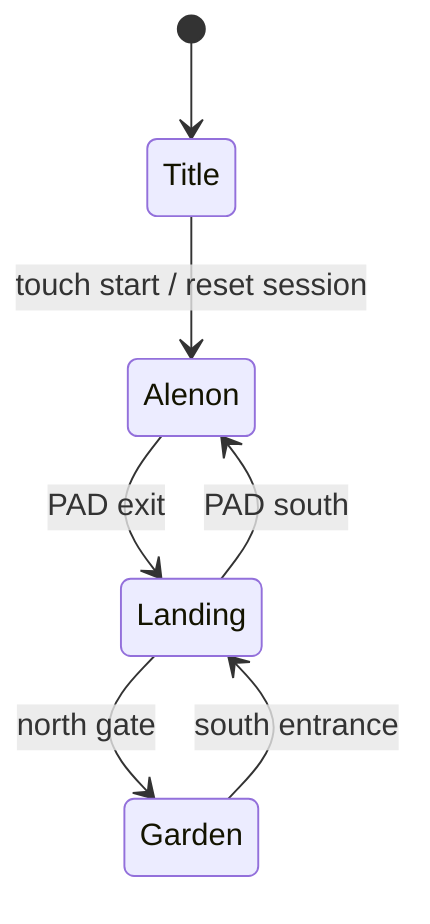
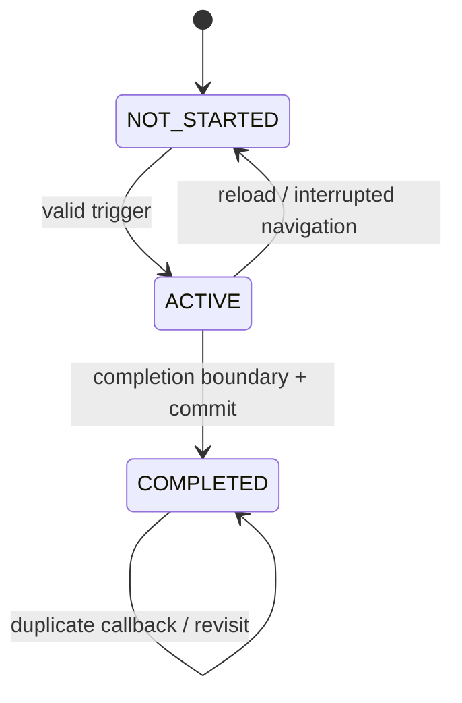

# TAROT BREAKER — Progress / Route / Save Contract (Phase 2A-1)

Status: **design only; BLOCKED on product decisions in §29**. This document does not authorize implementation. All `PROPOSED CONTRACT` statements describe the target, not shipped behavior. `FACT` and `CURRENT BEHAVIOR` refer only to the source at the pinned commit; no device gameplay was performed.

## 1. Baseline / Current HEAD

| Item | Value |
| --- | --- |
| Repository / branch | `reverse-shion/tarot-breaker-game` / `main` |
| CURRENT MAIN HEAD verified by GitHub comparison and fresh clone | `3f58bb417fb70a329700add0148b2932f8bd1e2e` |
| Phase 1A audit baseline | `3f58bb417fb70a329700add0148b2932f8bd1e2e` |
| Difference / relevant changes since audit | **NONE**; GitHub comparison reports identical commits and zero changed files |
| Working scope | Three playable scenes in `alenon.html`, `star-country-landing.html`, `index.html` (garden); title also lives in `index.html` |

## 2. Evidence and Scope

**FACT:** The route calls appear at [game.js L1651–1680](../../game.js#L1651-L1680), [alenon.html L2104–2109](../../alenon.html#L2104-L2109), [alenon.html L3028–3056](../../alenon.html#L3028-L3056), [alenon.html L3918–3933](../../alenon.html#L3918-L3933), [star-country-landing.html L887–1019](../../star-country-landing.html#L887-L1019), [star-country-landing.html L2225–2373](../../star-country-landing.html#L2225-L2373), [game.js L663–683](../../game.js#L663-L683). Event ownership appears in [dialogue.js L26–end](../../dialogue.js), [story-event-guard.js](../../story-event-guard.js), and the inline scripts of both maps. Storage appears in [map-journey.js](../../map-journey.js), [audio.js](../../audio.js) and the editor code noted below. Existing source-level tests in `tests/map-roundtrip.test.cjs` and `tests/garden-arrival.test.cjs` are corroboration, **not** a device playthrough; some test expectations reflect older dialogue and cannot establish current product intent.

**RISK:** `?from=` is user-editable, `TarotJourney` is tab-scoped, and the same session object mixes historical completion with companion position. A fabricated URL can currently bypass Alenon's prologue. A browser or tab loss can erase progress. A saved checkpoint that disagrees with event history could start a player in the middle of a mandatory scene.

**PROPOSED CONTRACT:** One validated, versioned progress record is the authority for historical facts and a safe checkpoint; a single-use handoff describes only the next navigation. Runtime, settings, and editor data remain separate. Every route and event listed below is an explicit registry entry. No story lines, choreography, audio, collision, visuals, movement, or present routing are altered by this design document.

Evidence vocabulary throughout: **FACT** = source observation; **CURRENT BEHAVIOR** = behavior directly implied by source; **RISK** = possible failure; **PROPOSED CONTRACT** = future target; **UNRESOLVED PRODUCT DECISION** = owner choice. Proposed map and event IDs are not claims that these IDs already exist.

## 3. Current Playable Route

**FACT / CURRENT BEHAVIOR:** `index.html` has two modes: title without `?from=landing`, and garden with it. Query strings in this table are literal strings in current source, not authorization to enter those scenes. Spawn descriptions distinguish authored positions from positions found after collision loading.

| From → to | File / query | Trigger and arrival | First visit / revisit and dependencies |
| --- | --- | --- | --- |
| TITLE → ALENON | `index.html` → `alenon.html?from=title&build=6bc2a38e` | `TOUCH TO START` invokes `begin()`, resets `TarotJourney`, and redirects; Alenon initial Shion `(716,330)` and automatically starts prologue | Each title start clears tab progress, including prior garden and landing flags. No durable save. |
| ALENON → LANDING | `alenon.html` → `star-country-landing.html?from=alenon` | Complete prologue, board PAD, fly past exit; landing enters PAD arrival animation near `(PAD_HOME.x, PAD_HOME.y)` then dismounts at `PAD_HOME.y − dismountOffsetY` | `story.completed` is local only; outbound does not write a historical event flag. Arrival from Alenon is selected by URL. Waiting Shiopon can be restored from session on later trips. |
| LANDING → GARDEN | `star-country-landing.html` → `index.html?from=landing` | Walk north through central gate; resonance/light and ~1.8 s timer precede navigation. Garden `begin()` places Shion at nearest walkable point to `(724,999)` (nominal default `(724,1015)` minus 16) | `landingMemoryDone` suppresses the Devil memory on revisit if tab state survives. Garden's `shioponMeet`, then `lumiereGate` depend on `gardenStory` flags, not on the URL's authenticity. |
| GARDEN → LANDING | `index.html` → `star-country-landing.html?from=garden` | Walk south through central entrance after exit rearmed; landing uses nearest ground point to `(724,257)` and separates a following Shiopon | `game.js` writes `{mode:'following'}` or `null` to journey just before redirect. Landing reads `returningFromGarden` and journey companion. On revisit `gardenStory` may suppress scenes. |
| LANDING → ALENON | `star-country-landing.html` → `alenon.html?from=landing-return` | Fly PAD south; Alenon starts at PAD landing animation, then dismounts at its PAD offset | `returningFromLanding` directly makes `storyBypass=true`, even without verified prologue completion. Alenon prologue can be bypassed through a hand-edited URL. Companion waits at landing if its journey mode was set when boarding. |

**FACT:** Landing PAD defaults are `(725,788)`, size 146, dismount offset 72 in [star-country-landing.html L844–864](../../star-country-landing.html#L844-L864); its editor layout can override these values in browser storage. Alenon PAD is read from its layout and return spawn calculated in `resetPlayer()` / `finishPadLanding()`. Garden verifies walkability at boot; the precise resolved coordinate can vary with collision data. Shiopon joins upon `shioponMeet` completion, follows through garden/landing, waits on landing when boarding, and rejoins on Alenon-to-landing arrival. The gate and PAD transitions do not themselves mark story completion.



No independent garden HTML file is used in the official route. `index.html?from=landing` is currently a garden entry and `index.html` is title. All five edges are present in current source; source inspection cannot prove mobile paint/audio timing.

## 4. Current State Inventory

`Future Classification` is the target semantic class, not the current storage. “Session” means a tab's `sessionStorage`; refresh in that tab can retain it, another tab/device cannot rely on it.

| State | Current Owner | Storage / lifetime | Gameplay meaning | Future Classification |
| --- | --- | --- | --- | --- |
| `tarot-breaker:map-journey-v1` object | `TarotJourney` | sessionStorage; current tab | Three ad hoc fields below; `reset()` overwrites with `{}` | LEGACY |
| `gardenStory.shioponDone` | `dialogue.js` | journey session | Shiopon meeting finished | PROGRESS |
| `gardenStory.lumiereDone` | `dialogue.js` | journey session | Lumiere conversation finished | PROGRESS |
| `gardenStory.joined` | `dialogue.js` | journey session | Shiopon joined; may disagree with `shioponDone` in malformed legacy state | PROGRESS (derive from meeting; no independent save bit) |
| `landingMemoryDone` | landing inline script | journey session | Devil flashback dialogue reached its current end | PROGRESS |
| `companion.mode/x/y` (`following`, `waiting`, `null`) | landing/game scripts | journey session | Story affiliation + landing wait, mixed with temporary point | PROGRESS for joined/waiting; coordinates RUNTIME/LEGACY |
| `story.started/locked/completed/scripted` | Alenon inline script | in-memory page lifetime | Prologue execution and access control; completion lost on navigation | `completed` PROGRESS; others RUNTIME |
| `orbInteraction.hasInspected/armed/inspecting/promptOpen` | Alenon inline script | in-memory page lifetime | Optional interaction and local rearm | RUNTIME; persistence of first-inspection wording is §29 decision |
| `devilEventStarted/Active`, `farewellActive`, `returnGreetingPlayed` | landing inline script | in-memory page lifetime | Local guard / current dialogue | `devilEventStarted` PROGRESS only after final line; others RUNTIME |
| `gardenExitArmed`, `leavingMap`, `ride.mode/progress`, `player.x/y/dir/target/frame` | game and map scripts | in-memory page lifetime | movement, gate rearm, PAD and animation | RUNTIME |
| `story.active/eventId/stepIndex/lineIndex/mode` | `dialogue.js` | in-memory page lifetime | active garden event playback | RUNTIME |
| `?from=title`, `?from=landing-return`, `?from=alenon`, `?from=garden`, `?from=landing` | page scripts | URL until navigation | start/bypass and entrance choreography | HANDOFF; untrusted legacy input |
| `?build=...`, `?v=...` | links/asset references | URL until navigation/cache | version/cache hints, not story state | LEGACY |
| `?skipPrologue=1` | Alenon | URL | skips story | EDITOR/dev bypass; never production progress |
| `?edit`, `?objects`, `?collision`, `?legacyCollision`, `?debug`, `?padEdit`, `?mapEditor`, `?collisionEditor`, `?depthEditor`, `?depthDebug`, `?navDebug`, `?viewport`, `?fgAlign` | map/editor scripts | URL until navigation | editing/testing/display | EDITOR or RUNTIME debug; never progress |
| `tarot-breaker:bgm-enabled` | `audio.js` | localStorage across browser restarts | BGM preference, default on | SETTING |
| `tarot-breaker-alenon-layout-v2`, `tarot-breaker-alenon-objects-v5`, `tarot-breaker-alenon-collision-draft-v2` | Alenon editor code | localStorage | map/layout/collision drafts | EDITOR |
| `tarot-breaker:star-landing-pad-layout-v1`, `tarot-breaker:star-landing-collision-v2`, `tarot-breaker:star-landing-passage-v2` | landing editor code | localStorage | PAD/collision/passage drafts; PAD layout may affect current render | EDITOR |
| `tarot-breaker:map-editor-v8`, `tarot-breaker:fountain-position-v2`, `tarot-breaker:waterfall-position-v3` | editor JS | localStorage | scene editing drafts | EDITOR |
| Alenon preview/editor HTML's older layout/objects keys | separate preview pages | localStorage | editor/preview drafts | EDITOR/LEGACY |
| checkpoint, save version, durable historical facts | no owner | absent | cannot Continue after tab loss | PROGRESS (proposed) |

**FACT:** `map-journey.js` swallows storage read/write errors and keeps in-memory state; invalid parsed primitives can still be assigned properties unsuccessfully. `audio.js` independently catches storage exceptions. Browser `window.TarotJourney`, `window.TarotDialogue`, `window.TarotStoryGuard`, `window.TarotAudio`, and `window.TarotStage` are runtime APIs, not serialized global-save formats. A search of playable JS/HTML finds no persistent save key. Editor storage is not a save, even if read on a production page.

## 5. Core State Model

**PROPOSED CONTRACT:**

| Domain | Definition / authority | May survive reload? |
| --- | --- | --- |
| `Progress` | Past committed facts (`completedEvents`), durable Shiopon story status, last **safe** checkpoint, schema version. One validated record, atomic writes. | Yes, across browser sessions when storage works |
| `Handoff` | One intended source→destination move with destination spawn and reason. One-use, session scope, never establishes completed events. | May bridge one page navigation/reload before consumption, never becomes a save |
| `Runtime` | Active event, PAD mode, motion, precise position/direction, dialogues, UI/audio objects, exit rearm, transient companion follow position. | No; reconstruct from checkpoint |
| `Settings` | User BGM preference; other user options if later introduced. Its own storage key. | Yes; survives New Game |
| `Editor State` | Draft layouts/collision/depth and debug URL switches. Namespaced keys; never interpreted as progress. | As existing editor code permits |

An arrival may affect runtime animation/spawn; it cannot prove an event happened. An event's completed flag cannot be set by a URL, direct file load, mere trigger, or animation start. Runtime event `ACTIVE` exists only in the current page. A save write is **one complete replacement record**; checkpoint, event flags and companion state must never be separately written into different durable keys.

## 6. Map ID Contract

Stable IDs use lowercase snake case, independent of filenames. “Safe” means designer-approved, walkable after collision assets load, outside an immediate undesired trigger; current approximate coordinates are evidence, **not** fixed save payload. Startup validates spawn against current collision and substitutes the map's known safe default; it never persists fallback coordinates.

| `mapId` | `entryFile` | `debugName` | Valid arrival contexts | Safe spawn IDs / proposed use | Default spawn |
| --- | --- | --- | --- | --- | --- |
| `alenon` | `alenon.html` | アレノン遺跡 | `new_game`, `continue`, `from_landing` | `intro` (authored `(716,330)`, pre/post prologue), `pad_return` (dismounted PAD after valid return) | `intro` |
| `star_country_landing` | `star-country-landing.html` | PAD離着陸場 | `continue`, `from_alenon`, `from_garden` | `pad_ground` (after landing/dismount), `garden_entrance` (nearest ground to `(724,257)`) | `pad_ground` |
| `star_gate_garden` | `index.html` with garden entry mode | 星門庭園 | `continue`, `from_landing` | `south_gate` (walkable nearest to `(724,999)` at baseline collision) | `south_gate` |

`title` is a **screen mode**, not a checkpoint map. The `index.html` file alone must never be used as a map ID. Arrival `from_alenon`/`from_landing` may play current PAD/gate choreography before landing on the corresponding safe checkpoint; Continue directly reconstructs a stable ground scene with no flight/gate animation. Registry initialization checks every supported spawn against loaded collision; if an ID is unknown, resolve to valid default; if the default itself is invalid, show recoverable load error/return to title rather than place the actor inside collision. `pad_return`, `pad_ground`, and `garden_entrance` are **semantic IDs**, not pixel locks. Designers must validate collision safety before implementation (§29/PR integration).

## 7. Event Inventory / Event IDs

| Stable `eventId` | `mapId` | Current trigger | Observed end / proposed completion | Replay policy target | Proposed checkpoint effect |
| --- | --- | --- | --- | --- | --- |
| `alenon_prologue` | `alenon` | title arrival auto-start or direct Alenon start button; bypass on `?from=landing-return`/debug | `runPrologue()` after final scripted walk sets `story.completed=true`, unlocks control [L3020–3056](../../alenon.html#L3020-L3056) | Once per New Game; interrupted replays whole prologue | `alenon/intro` or approved safe post-event spawn, atomic with completion |
| `landing_devil_memory` | `star_country_landing` | ground Shion enters north corridor (Y≤355, central X) | `runDevilMemoryEvent()` after final advanced dialogue sets `landingMemoryDone=true` [L974–986](../../star-country-landing.html#L974-L986) | Once per New Game; interrupted replays whole scene | `star_country_landing/pad_ground` or approved safe post-event spawn, atomic |
| `garden_shiopon_meet` | `star_gate_garden` | near Shiopon / mandatory Y gate; `dialogue.js` and `story-event-guard.js` both observe | `finishEvent()` after **all** scripted actions; sets `shioponDone` and `joined` [dialogue.js L502–525](../../dialogue.js#L502-L525) | Once per New Game; interrupted replays; following begins only after committed completion | `star_gate_garden/south_gate`, atomic with companion join |
| `garden_lumiere_gate` | `star_gate_garden` | after Shiopon joined, near Lumiere / mandatory Y gate | `finishEvent()` after final scripted action; sets `lumiereDone` [dialogue.js L502–525](../../dialogue.js#L502-L525) | Once per New Game; interrupted replays | `star_gate_garden/south_gate`, atomic |

**FACT:** Orb inspection is repeatable, with one different first-time line guarded by `orbInteraction.hasInspected` only in-page; farewell and return greeting are route reactions, with local guard booleans, not durable `completed` events. PAD boarding/landing and gate light are transition actions, not the four story events. **PROPOSED CONTRACT:** Keep these as runtime interactions unless §29 changes their narrative persistence; do not invent `garden_intro_event` or persist an event that has no completion callback. The exact trigger coordinates and dialogue remain unchanged.

## 8. Event State Machine

For each registered event, `NOT_STARTED` means no durable completion; `ACTIVE` is a page-local lock after trigger; `COMPLETED` means its single atomic progress commit succeeded. No persisted `INTERRUPTED` is needed: after refresh/crash an active event becomes `NOT_STARTED` and is eligible to replay at its authored trigger. An attempted commit that fails storage stays `ACTIVE` until a safe retry/controlled fallback; never show a false durable Continue state.



`COMPLETED` can become `NOT_STARTED` **only** via explicit New Game/reset. Event dependency registry: `garden_lumiere_gate` requires `garden_shiopon_meet`; `garden_shiopon_meet` requires access via legitimately completed route history; `landing_devil_memory` presumes `alenon_prologue` in normal gameplay. Validation rejects an impossible subset instead of silently manufacturing prerequisites.

## 9. Completion Boundaries

**FACT:** The four current exact code boundaries are in §7. **PROPOSED CONTRACT:** Hook after the same scene's final dialogue/action and before release of player control or next eligible transition; commit event + safe checkpoint + companion semantic change in one record. If commit fails, keep in-memory runtime playable with explicit warning/diagnostic and retry at the next safe boundary; do not persist `completed` without its checkpoint. Do not mark on event start, intermediate dialogue, URL navigation, or `?from=`. No mid-dialogue index or animation is saved. The existing Alenon `storyBypass` sets `completed=true` without ever running the prologue; that is **not** acceptable proof for the new registry. An `ACTIVE` scene on reload restarts from a safe checkpoint and may replay in full.

**UNRESOLVED PRODUCT DECISION:** Whether first Orb inspection wording, departure farewell, and return greeting should be remembered beyond a tab is not established in source. Default: no additional permanent event IDs. Whether to advance checkpoint on each of the four completions and which safe post-event spawn to use also needs owner approval (§29). The technical safe default above may backtrack the player to the start of the map.

## 10. Handoff / Arrival Contract

**PROPOSED CONTRACT:** `Handoff = { sourceMapId, destinationMapId, spawnId, reason }` with reason enum `title_start`, `pad_to_landing`, `gate_to_garden`, `garden_to_landing`, `pad_to_alenon`; token/nonce may be added as transport metadata to prevent stale reuse. Validate the five `(source,destination,reason,spawn)` edges against a fixed route table: title→Alenon/`intro`; Alenon→landing/`pad_ground`; landing→garden/`south_gate`; garden→landing/`garden_entrance`; landing→Alenon/`pad_return`. Title is a screen source, never a save map. Handoff resides in one session key, is set before navigation, is consumed only by its destination after validation, and is then cleared; a duplicate/stale/invalid one is discarded. Do not infer source from referrer or arbitrary `from` query; legacy query may be accepted **only** as a presentation hint when consistent with a verified, same-tab handoff and validated progress. Link `?build` and cache versioning are independent.

At transition start, keep source checkpoint authoritative while effect runs. On destination ready after its assets and collision/spawn validation, consume handoff and atomically commit destination safe checkpoint. Before that commit, refresh/crash returns to source checkpoint. After it, refresh/crash returns to destination safe checkpoint. A completed story event must be committed at its own boundary before route advancement. Never restore in-flight PAD/gate animation as a checkpoint. Same-tab reload of the destination after handoff consumption relies on the committed destination checkpoint, not the stale query. On navigation failure retain source checkpoint and allow a retry. No handoff can grant `completedEvents`.

## 11. Companion Story State

**FACT:** In garden, joining follows `shioponMeet` completion, not a serialized coordinate. Garden→landing writes `following`; landing→Alenon boarding writes `waiting` with x/y; Alenon→landing arrival re-joins, optionally plays greeting; garden entry places following Shiopon beside Shion. Alenon has no Shiopon on screen. The session value may be `null`, `following`, or `waiting`; on landing the `?from=garden` query changes whether following is visible [landing L1013–1082](../../star-country-landing.html#L1013-L1082).

**PROPOSED CONTRACT:** Persist one enumerated story status `not_joined`, `joined_with_shion`, or `waiting_at_landing`. `not_joined` is required before `garden_shiopon_meet`; completion atomically changes it to `joined_with_shion`. Boarding from landing while joined changes it to `waiting_at_landing` at a safe boundary; return landing arrival changes it to `joined_with_shion` after dismount. On Alenon while waiting, do not render Shiopon. On garden/landing while joined, reconstruct a safe trailing spawn relative to Shion, validated against collision. Do not save animation frame, temporary coordinate, facing, motion target, trail, dialogue pose, or transition state. `waiting_at_landing` is a story/location fact, **not** the previous exact `(x,y)`; use an authored waiting anchor and prevent overlap. Invalid combinations fail validation; no silent story repair. The greeting/farewell replay policy after interruption is §29.

## 12. Checkpoint Contract

A checkpoint is the last **fully committed safe restart**, `{mapId, spawnId}` plus the **same record's** event history and companion status. It is not current position or last visited HTML. Scene entry and each approved event completion are candidate safe boundaries; transient navigation is not. Checkpoint update is permitted only once collision-safe spawn, mandatory event preconditions, companion rules and atomic write are all valid. A destination checkpoint is committed after safe arrival setup, never at click/transition start. New Game has an initial Alenon `intro` checkpoint only when the title start transaction succeeds; no persisted current pixel coordinate. ID remapping on map changes can preserve saves without migrating every player coordinate. Unknown spawn falls back to a verified registered default **only if that default can coexist with saved completed events and companion state**; otherwise quarantine save and offer title/new game. Restore never opens a dialogue halfway through or places player in the active gate/PAD effect.

## 13. State Persistence Classification

| State | Classification | Reason / recovery |
| --- | --- | --- |
| checkpoint + completed event IDs + semantic companion status + schema version | PERSISTENT | same atomic record; validate on load or quarantine |
| single-use arrival handoff | SESSION | route context only; clear stale token; checkpoint on loss |
| active event, player pixel coordinate/direction, dialogue index, animation frame, actor follow path, PAD/portal mode, current volume/fade state | RUNTIME ONLY | reconstruct at safe spawn; restart unfinished event at authored trigger |
| BGM enabled (`tarot-breaker:bgm-enabled`) | SETTING | independent key; default on when unavailable; survives reset |
| layout/collision/depth/position drafts | EDITOR ONLY | retain under existing keys, never read as game history |
| old `TarotJourney` and `?from=` interpretations | LEGACY | transitional adapter only; no automatic trust |

No DOM node, HTMLElement, Audio, AudioContext, GainNode, Promise, timer ID, RAF ID, CSS class, transition overlay, movement target, or mutable script object is serialized.

## 14. Persistence Technology Decision

| Option | Complexity / debug | Migration / schema | Mobile reliability / failure handling |
| --- | --- | --- | --- |
| `localStorage` one JSON save key | low; inspectable in browser tools; synchronous small record | explicit `version`; atomic replacement via one `setItem` | adequate for tiny same-origin save on GitHub Pages and iOS Safari, but quota/private storage/errors and user-cleared data possible |
| IndexedDB | higher; async transaction/lifecycle and more integration | upgrade transactions; more intricate recovery | useful for large data or many slots, no needed benefit for one tiny record |
| `sessionStorage` | low but tab-scoped | simple | insufficient for durable Continue, already demonstrated |

**PROPOSED CONTRACT:** `localStorage` key `tarot-breaker:progress-v1`, one small JSON object. Validate before writing and after reading; use synchronous single-key replace to commit checkpoint and completed events together. Keep last known-good in-memory state on write exception; do not claim durable success or erase existing save. Storage failure permits a temporary play session with Continue explicitly unavailable. No backend, account, cloud sync, or cross-device recovery. Do not write on each animation frame. Browser eviction/clearing remains an external loss risk, not a guaranteed backup.

## 15. Save Schema

**PROPOSED CONTRACT, version 1; canonical serialized example after completing Alenon and arriving on landing:**

```json
{
  "version": 1,
  "checkpoint": { "mapId": "star_country_landing", "spawnId": "pad_ground" },
  "completedEvents": ["alenon_prologue"],
  "companion": "not_joined"
}
```

| Field | Type / required | Values / meaning | Invalid/missing fallback |
| --- | --- | --- | --- |
| `version` | integer, required | exactly `1` for this contract | missing/future → quarantine; supported old → explicit migrator |
| `checkpoint` | plain object, required | last committed safe restart | missing → quarantine, no Continue |
| `checkpoint.mapId` | string, required | §6 ID, not HTML or URL | unknown → quarantine; do not guess a map |
| `checkpoint.spawnId` | string, required | registered ID for the map | unknown → validated map default if story-safe; otherwise quarantine |
| `completedEvents` | array of unique registered strings, required | permanent completed story facts, no ACTIVE values | duplicates deduplicate with diagnostic; wrong type/unknown → quarantine, no silent drop |
| `companion` | enum string, required | `not_joined`, `joined_with_shion`, `waiting_at_landing` | invalid → quarantine; derive only in a reviewed migration |

No timestamp, HTML filename, arbitrary URL, active event, history of arrivals, exact coordinates, or user setting in v1. Validate prerequisite graph and semantic consistency: Shiopon joined requires `garden_shiopon_meet`; Lumiere requires Shiopon; checkpoints landing/garden require Alenon; garden checkpoint requires valid gate route provenance only insofar as completed history can attest prerequisites; waiting requires Shiopon joined and a route where landing can be reached. A gate arrival **alone** never grants an event completion. Exact inclusion of landing memory in a garden prerequisite is §29: code trigger blocks movement during its scene but does not explicitly gate the navigation function on durable `landingMemoryDone`.

## 16. Schema Versioning / Recovery

Keep the raw save unchanged on read failure; log structured developer diagnostic (`reason`, sanitized key, version) without logging private content. Do not overwrite a future or corrupt record merely by loading the title. A deliberate New Game may replace it only after the owner/user consciously invokes the New Game action. A valid current record is normalized into a fresh immutable runtime value, never edited in-place through an exposed reference.

| Input / failure | Recovery decision | Playable result |
| --- | --- | --- |
| Valid v1, registered map/spawn/events, consistent dependencies | load as-is | Continue from safe checkpoint |
| No save key | none to migrate by default | title / New Game |
| Missing version or missing required field | quarantine raw, diagnostic; do not infer | title / New Game, no Continue |
| Supported old schema (only explicit migrator with tests) | migrate in memory; validate; replace only after successful atomic commit | Continue if successful; otherwise preserve old and title |
| Future unknown version | preserve raw, diagnostic | title / New Game; never downgrade automatically |
| Malformed JSON or nonobject/wrong field type | preserve raw, diagnostic | title / New Game |
| Unknown map ID or event ID / impossible dependencies | preserve raw, diagnostic | title / New Game, no fabricated progress |
| Unknown spawn ID on known map | validate safe registered default and story compatibility; commit repaired record only after explicit verified restore | Continue at safe default or title if unsafe |
| `localStorage` unavailable / access throws | in-memory default and diagnostic | New Game playable, Continue unavailable; do not claim persistence |
| Quota or write failure | keep prior durable record and runtime state; diagnostic, retry at safe boundary | gameplay can continue; honest warning/Continue reflects last confirmed save |
| Session storage unavailable / stale handoff | discard handoff, consult valid durable checkpoint | resume checkpoint/title; never trust query |

Unknown **event IDs are not silently discarded**: this can misrepresent future save data as a past schema. Quarantine means preserve bytes in place without mutating them; UI may show a recoverable generic message in the implementation, subject to product copy approval.

## 17. Title / New Game / Continue

**FACT:** `TOUCH TO START` on root title calls `TarotJourney.reset()` and redirects to `alenon.html?from=title&build=6bc2a38e`; it does not inspect or clear any durable gameplay record (none exists). `index.html?from=landing` bypasses title and starts garden automatically. Garden reset button resets page runtime and `dialogue.js` garden flags, not a global durable New Game. BGM preference is independent.

**PROPOSED CONTRACT:** `NEW GAME` clears/replaces only progress and stale session handoff, starts Alenon `intro` with `completedEvents=[]`, `companion=not_joined`; first prologue starts normally. It does **not** clear BGM preference, accessibility/user settings, or editor drafts. `CONTINUE` validates save, restores checkpoint/history/semantic companion and reconstructs neutral runtime at its spawn, without replaying completed events; if no valid durable save, Continue is unavailable. An interrupted uncompleted event may replay in full. A new game must not destroy an existing valid save before the new initial record can be durably written; transactional/rollback strategy and owner-approved replacement UX in §29. No title UI change in this phase.

## 18. Reload Contract

The table is the **proposed** future behavior. In all rows source of truth is the last successfully committed v1 record; a pending valid handoff can affect only a destination arrival, and once consumed the destination checkpoint owns reload. Checkpoint `X/safe` means the recorded safe ID, not the pixel at which the browser was refreshed.

| Case | Resume map / spawn | Event behavior | Source of truth |
| --- | --- | --- | --- |
| A. ordinary exploration | recorded checkpoint `X/safe` | completed remain completed; uncompleted eligible at trigger | v1 progress |
| B. just before trigger | recorded checkpoint `X/safe` | uncompleted event starts when trigger next reached | v1 progress |
| C. dialogue midway | recorded checkpoint `X/safe` | entire uncompleted event may replay; no line index | v1 progress; ACTIVE discarded |
| D. event animation midway | recorded checkpoint `X/safe` | animation resets; whole event replays at authored trigger | v1 progress; ACTIVE discarded |
| E. during map transition | source checkpoint before destination commit; destination checkpoint after commit | no fabricated completion; animation restarts only on fresh valid handoff, never from save | v1 + valid unconsumed handoff for single crossing |
| F. immediately after completion | new checkpoint `X/safe` and event complete if single commit succeeded; otherwise previous checkpoint and replay | duplicate completion safe | atomic v1 record |

**RISK:** A completed event's checkpoint at the beginning of a map can cause backtracking; the replay of a greeting/farewell midway may produce discontinuity. Neither authorizes saving its dialogue frame.

## 19. Direct URL Contract

**CURRENT BEHAVIOR:** `/` and `/index.html` show title. `/index.html?from=landing` auto-enters garden, `/alenon.html?from=landing-return` bypasses prologue, `/alenon.html?from=title` auto-starts it, `/star-country-landing.html?from=alenon|garden` changes PAD/spawn/companion presentation. Debug/editor queries are handled by their own code; `skipPrologue=1` bypasses Alenon story. These routes are not validated against a durable save.

**PROPOSED CONTRACT:** Resolve entry before constructing story runtime. The browser path selects a requested page, not proof of progress. Production policy:

| Access | No valid save | Valid save matching requested map | Valid save for different map | Invalid save / debug query / legacy `from` |
| --- | --- | --- | --- | --- |
| `/` or `/index.html` without valid handoff | title / New Game | title with Continue option | same | invalid → title with recovery; debug only if explicit developer mode |
| `/alenon.html` | title (or explicit fresh New Game) | Continue at Alenon checkpoint | redirect to saved checkpoint via title/Continue entry | ignore unverified `from`; never bypass prologue |
| `/star-country-landing.html` | title | Continue at landing safe spawn | redirect to saved checkpoint via title/Continue entry | ignore unverified `from`, do not fabricate companion/event |
| `/index.html?from=landing` | title | garden only if valid matching checkpoint **or** unconsumed validated handoff from landing | otherwise saved checkpoint/title | query alone never starts garden or completes any event |

For every file, a validated unconsumed handoff to that file takes precedence over a previous checkpoint for *one* crossing, but requires source checkpoint/event preconditions; a plain reload after consumption uses destination checkpoint. Never allow `?skipPrologue=1`, `?from=landing-return`, or editor query in production to write progress. Keep existing editor pages usable through an explicit isolated developer entry; editor modes do not migrate their state into gameplay. If direct URL behavior needs a different visitor experience, §29 requires owner choice; no silent canonicalization from a false query.

## 20. Reset Contract

**PROPOSED CONTRACT:** New Game/reset replaces progress (`checkpoint`, `completedEvents`, companion story state) with a clean initial record and clears outstanding handoff/legacy compatibility cache in memory. It leaves `tarot-breaker:bgm-enabled`, future accessibility settings, all editor draft keys, and developer configuration intact. If replacement cannot be written, keep the old confirmed save and allow temporary session New Game only with an explicit nonpersistent status. Never use `localStorage.clear()` or `sessionStorage.clear()`. A runtime-only scene reset must not be confused with New Game or change durable events.

## 21. Source of Truth Matrix

| Responsibility | Current owner | Target owner |
| --- | --- | --- |
| checkpoint | none / current URL and map spawn loosely substitute | `Progress` v1 validated record + map spawn registry |
| completed events | Alenon local `story`, journey `landingMemoryDone`/`gardenStory` | `Progress.completedEvents`; event scripts own trigger and completion callback only |
| active event | Alenon/landing local flags, `TarotDialogue.story` | map event runtime only, no persistence |
| arrival context | per-page `?from` and implicit session companion | `Handoff` one-use validator + route registry |
| companion story | `gardenStory.joined` and journey `companion` | `Progress.companion`, invariant against completed meet |
| companion positioning/animation | `game.js` / landing runtime | map runtime and authored spawn anchors |
| audio preference | `audio.js` localStorage | settings owner (may remain `audio.js`, separate key) |
| editor drafts | individual map/editor modules | their existing editor owners, excluded from progress |
| runtime animation/transition | map local code | same map local code, never serialized |

`shared-dialogue.js` remains UI, not progress owner. `story-event-guard.js` remains a trigger gate while maps migrate; after integration only the progress service decides historical eligibility. No general-purpose global event bus or game engine is mandated.

## 22. Proposed API

API names illustrate boundaries; signatures are contractual, not implementation algorithms. All write APIs validate known IDs and either return an explicit result or throw a typed validation error caught by the caller. Storage exceptions return `persisted:false` while keeping old confirmed data. Return fresh copies/read-only values; never expose mutable internal record.

| API | Input → output / responsibility | Side effect / failure / idempotency |
| --- | --- | --- |
| `Progress.load()` | none → `{status:'valid'|'none'|'invalid'|'unavailable', state?, reason?}` | reads/validates v1, no write; repeat safe; quarantines malformed data without overwrite |
| `Progress.getCheckpoint()` | none → `{mapId,spawnId}` copy or `null` | no write; only confirmed safe checkpoint |
| `Progress.isEventCompleted(id)` | registered event ID → boolean | read only; unknown ID is validation error, never treated as true |
| `Progress.completeEvent(id, checkpoint)` | registered event + validated `{mapId,spawnId}` → `{completed, persisted}` | checks prerequisites, writes one atomic record; duplicate returns existing success with no duplicate scene/companion effects; failed write retains last confirmed record |
| `Progress.commitArrival(handoff, safeSpawnId)` | validated consumed handoff + verified spawn → `{committed,persisted}` | one record write; duplicate destination commit safe, wrong edge rejected, no event completion |
| `Progress.setCompanion(status, checkpoint)` | approved story transition + safe checkpoint → `{committed,persisted}` | atomic semantic update; repeated identical value no-op; cannot join without meet |
| `Progress.resetGame()` | explicit New Game action → `{started,persisted}` | clears pending handoff; atomically replaces v1 with initial checkpoint only after successful write; old save retained on failure; idempotent only with same action token (avoid accidental second reset) |
| `Handoff.create(edge)` | registered edge → opaque one-use token / handoff | validate source checkpoint and prerequisites, write session key before redirect; failure leaves old checkpoint authoritative; no historical writes |
| `Handoff.consume(destinationMapId)` | destination ID → validated handoff or `null` | match route + destination + token, clear after claim; reject stale/unknown, do not mark progress; repeat yields `null` |
| `Route.resolveEntry(path, query, progress, handoff)` | browser entry → `{screen,mapId?,spawnId?,arrival?}` or recoverable error | validate before boot; legacy query merely hint, no progress writes |

Route integration coordinates `Handoff.consume` and `Progress.commitArrival`: if destination validation/write fails, use the source checkpoint for recovery, not an uncommitted arrival. For refresh between consume and commit, keep token claim reconstructable within the current navigation attempt or consume+commit in one safe startup phase; do not clear the only proof of a valid transition before destination checkpoint can be committed. An idempotency token or staged session handoff is acceptable, provided a second tab cannot invent history. `setCheckpoint` as a freely callable public primitive is intentionally omitted; only approved event or route boundaries may advance it.

## 23. Invariants / Acceptance Checks

1. Completed event IDs only grow within a game; only explicit New Game removes them.
2. One durable key contains the *entire* consistent checkpoint + completed event set + companion state; no torn multi-key history.
3. URL/referrer/handoff never proves historical completion or joins Shiopon.
4. A checkpoint names a known map and collision-safe spawn; invalid spawn falls back safely or blocks Continue, never teleports to raw coordinates.
5. `garden_lumiere_gate` completion requires `garden_shiopon_meet`; joined companion requires completed meet. An uncompleted mandatory event cannot be skipped by Continue.
6. Unknown/future/corrupt save cannot crash boot or silently erase the old record.
7. Settings and editor drafts survive New Game; editor data is never interpreted as gameplay progress.
8. No active event, dialogue index, animation, PAD/gate state, audio object or pixel coordinate is in v1.
9. Repeated event completion and arrival commit cannot replay side effects or duplicate flags; failed write cannot claim durable completion.
10. On navigation failure, last committed checkpoint remains usable; destination checkpoint is committed only after destination is safely ready.
11. Every new map/event declares a stable ID, valid route/spawn, prerequisites, completion boundary, replay policy, and tests before enabling Continue there.

## 24. Backward Compatibility

**FACT:** old `TarotJourney` has only `gardenStory`, `landingMemoryDone`, and `companion`; it has **no** saved map/checkpoint and no durable proof that Alenon's prologue finished. The title currently resets it. `gardenStory` can contain inconsistent booleans; `companion` can contain arbitrary coordinates. A query parameter is not corroboration.

**PROPOSED migration stages (separate PRs):**

1. Detect `tarot-breaker:map-journey-v1` with exception-safe parse, do not mutate it.
2. Read only whitelisted booleans/enums; ignore x/y; reject primitives, impossible booleans and unknown modes.
3. Normalize `shioponDone → garden_shiopon_meet`, `lumiereDone → garden_lumiere_gate`, `landingMemoryDone → landing_devil_memory`; `joined` must agree with `shioponDone`. No old key proves `alenon_prologue` or a valid checkpoint. Thus **do not automatically create a durable save** from the old session.
4. Verify proposed import against owner-selected migration policy (§29); only an explicit trusted source of Alenon completion/checkpoint can make a valid v1 record. If unavailable, keep old session for current-tab gameplay under a compatibility adapter, with Continue unavailable across tabs.
5. Temporarily have map consumers read new progress first and validated old session only for permitted current-tab fallback; write new progress at approved completion boundaries, not by inventing history. Do not dual-write conflicting event truth.
6. Migrate Alenon, landing, garden consumers one at a time; tests cover mixed old/new state and route round trips. Transitional `?from=` may preserve choreography only with verified handoff.
7. Retire old reads and remove the old journey key **only after** all map consumers use new authority, production route/reload/direct URL tests pass, and the owner approves handling of existing tabs. Never delete old keys during initial detection or merely because a parse failed.

The migration plan cannot resolve a tab already in the garden with no durable Alenon evidence by technical inference. That is a real compatibility/product choice, not a reason to mark prologue complete based on `?from=landing`.

## 25. Failure Safety

Storage access is guarded at construction, read, and write. Any exception or JSON/schema mismatch yields a recoverable title/New Game path and a console diagnostic, not a blank game. If `sessionStorage` fails, a cross-page transition may fall back to the last confirmed checkpoint; do not silently use a route query to bypass a story gate. If `localStorage` fails, keep a clearly nonpersistent in-memory playthrough; old known-good durable bytes remain untouched. If destination assets/collision fail, use existing recoverable load error and source checkpoint, never commit destination. If progress and direct URL differ, load save at its checkpoint through an explicit Continue path. If no verified walkable spawn exists, halt that resume with recoverable title, never spawn inside geometry. A save with unknown map/event/version is quarantined, not modified. Diagnostics must name the failure class and map/event ID where safe, without dumping raw data. Mobile browser storage can be deleted by user/browser; no guarantee of cloud backup.

## 26. State Transition Table

| Current state | Action | Condition | Next state | Persist? | Checkpoint? |
| --- | --- | --- | --- | --- | --- |
| TITLE / no game | New Game | initial record write succeeds | ALENON `intro`, prologue NOT_STARTED | yes v1 | Alenon `intro` |
| TITLE / valid game | Continue | schema, spawn, prerequisites valid | checkpoint map / neutral runtime | no new write | use saved |
| ALENON / NOT_STARTED | prologue trigger | valid New Game or unfinished checkpoint | ACTIVE | no | prior |
| ALENON / ACTIVE | final scripted walk/control release | all awaited steps finished | COMPLETED | one atomic v1 | safe Alenon |
| ALENON / completed | PAD exit | valid route, handoff created | transit to landing | session only until arrival | source until ready |
| LANDING / ground | Devil memory trigger | event not complete | ACTIVE | no | prior |
| LANDING / ACTIVE | final line advanced | full sequence finishes | COMPLETED | one atomic v1 | safe landing |
| LANDING / ground | north gate | route preconditions + valid handoff | transit to garden | session then arrival v1 | source→garden on ready |
| GARDEN / no join | Shiopon trigger | prerequisite valid | ACTIVE | no | prior |
| GARDEN / ACTIVE meet | final command finishes | valid event | COMPLETED + joined | one atomic v1 | safe garden |
| GARDEN / joined | Lumiere trigger | meet complete, Lumiere incomplete | ACTIVE | no | prior |
| GARDEN / ACTIVE Lumiere | final command finishes | valid event | COMPLETED | one atomic v1 | safe garden |
| GARDEN / explore | south exit | valid handoff | LANDING / beside Shion | session then arrival v1 | source→landing on ready |
| LANDING / joined | board PAD | approved waiting boundary | waiting at landing | one atomic v1 | landing safe before flight |
| LANDING / flying | south exit | valid handoff | ALENON / Shiopon waiting | session then arrival v1 | source→Alenon on ready |
| LANDING / arriving from Alenon | dismount/rejoin | prior waiting state | joined with Shion | atomic v1 after safe landing | landing safe |
| any ACTIVE / transit | reload or failure | no completion/arrival commit | last confirmed checkpoint | no | unchanged |
| any valid game | explicit New Game | replacement write succeeds | fresh ALENON | yes v1 | `intro` |

Only scene hooks at already authored boundaries are proposed. If product owner wants precise resume after an event rather than safe start-of-map backtracking, that needs authored safe spawn design and approval.

## 27. Test Matrix for Following PRs

Use a real or simulated browser storage adapter plus page-level smoke tests; unit tests alone cannot verify scene rendering on iPhone/iPad. Each row specifies `precondition → action → expected visual/gameplay; expected stored state; must-not-happen`. `P` denotes last committed v1, `H` a validated pending handoff; editor/settings keys are left intact in all New Game cases.

| ID | Precondition → action | Expected visual/gameplay | Expected stored state | Must not happen |
| --- | --- | --- | --- | --- |
| R1 TITLE→ALENON | no save → New Game/touch | title→Alenon intro, prologue starts | P fresh Alenon/intro; H consumed | stale old story flags |
| R2 ALENON→LANDING | prologue complete → PAD south | current flight/landing and grounded Shion | P source until arrival ready, then landing/pad_ground | early destination commit |
| R3 LANDING→GARDEN | completed Alenon, walk north after memory → gate | current ~1.8 s light/SE, garden south entry | H until ready then P garden/south_gate | `from` used as event proof |
| R4 GARDEN→LANDING | joined, garden south exit → landing | Shiopon beside/behind Shion at north entry | P landing/garden_entrance, joined | overlap/intro replay |
| R5 LANDING→ALENON | joined, board and fly south → Alenon | Shiopon waits; Shion PAD arrival; no completed prologue replay | P Alenon/pad_return, waiting | raw waiting x/y saved |
| S1 First visit | fresh P → four story triggers in order | each scene plays at authored trigger and returns control | exactly four IDs added at respective completion boundaries | completion at trigger/start |
| S2 Revisit | P with completed event → re-enter map | completed scene suppressed; ordinary exploration | same completed set | duplicate playback/write |
| S3 Incomplete | trigger scene but leave/reload before end | safe scene; full scene retriggerable | event ID absent | false completion |
| S4 Companion | meet completed, garden→landing→Alenon→landing | follows, waits, rejoins at authored anchors | joined→waiting→joined in atomic records | cloned or floating sprite |
| L1 Explore reload | P landing/pad_ground; move → reload | restart at safe PAD ground | same P | exact arbitrary coordinate restore |
| L2 Before trigger reload | P with event incomplete → reload | event starts only when trigger reached | unchanged P | premature completion |
| L3 Dialogue reload | active Shiopon dialogue → reload | safe spawn, scene restarts from start on approach | meet absent | half dialogue resume |
| L4 Animation reload | active prologue wind/PAD → reload | safe spawn; required unfinished story replay | old P | half transition/visual corruption |
| L5 After completion reload | final Lumiere action + write → reload | Lumiere scene remains completed | same P with Lumiere ID | duplicate effects |
| L6 Transit reload | source H before arrival commit, then destination commit → reload each side | before: source safe; after: destination safe | P changes exactly once | phantom completion, stuck loading |
| V1 New Game | valid old P + BGM off + editor draft → New Game | new Alenon prologue | fresh P; setting/draft unchanged | `localStorage.clear()` |
| V2 Continue | P garden with meet done → Continue | safe garden, joined companion, no meet repeat | unchanged P | title reset |
| V3 Valid checkpoint | all registered IDs and safe spawn → Continue | walkable safe location | unchanged P | actor in collision |
| V4 Invalid checkpoint/spawn | unknown map, then known map/unknown spawn → Continue | map unknown: title; spawn: verified default or title | raw preserved until approved repair | arbitrary coordinate or invented map |
| V5 Old/future schema | supported migrator fixture, then future version → load | supported validated import only; future goes title | future raw intact | silent downgrade |
| V6 Corrupt JSON | malformed save → open title | New Game available; Continue unavailable | corrupt raw untouched | boot exception/overwrite |
| V7 Storage failure | deny session, local reads/writes or quota → start/reload | playable nonpersistent New Game or last confirmed checkpoint | no false successful durable state | crash/false Continue |
| D1 No save URLs | open `/index.html`, `/alenon.html`, `/star-country-landing.html` directly | title or explicit New Game | no completed IDs | map skip from path |
| D2 Matching save | P landing → direct landing URL | Continue at registered landing spawn | P unchanged | PAD in-flight restore |
| D3 Different save | P Alenon → direct landing URL | title/Continue routes to Alenon | P unchanged | landing story fabrication |
| D4 Route query | no save or P other map → `?from=landing`, `?from=landing-return`, `?skipPrologue=1` | production title/saved safe entry | P unchanged | prologue skip/companion join |
| D5 Developer query | explicit isolated editor mode → editor load | editor existing experience | gameplay P unchanged; draft may change | editor data imported to P |

Acceptance requires iPhone/iPad manual smoke across the five route edges and reload during at least prologue dialogue, garden dialogue, PAD flight and gate overlay; diagnostics and storage assertions supplement visible checks. Tests must use current dialogue and collision values; older fixtures with stale text are not specifications.

## 28. Implementation PR Plan (not started)

Each PR is reviewable/revertible independently, depends on the previous accepted contract, and does **not** change text, art, audio mix, collision JSON, map layout, or movement feel. If a PR requires one, return to product review instead of widening scope.

| PR | Goal / expected files | Must not change | Tests / acceptance | Rollback boundary / dependency |
| --- | --- | --- | --- | --- |
| 2A-2 | Pure progress registry/validation/localStorage adapter in new `progress.js`, `route-registry.js`, tests | all map HTML, story, audio, collision | schema, idempotence, corruption, prerequisite, quota unit tests; no player change | remove unused modules; depends on §29 decisions |
| 2A-3 | Read-only legacy adapter / explicit migration policy in new adapter + tests | old keys and map behavior | inconsistent old state, absence of prologue proof, mixed tabs | remove unused adapter; after 2A-2 |
| 2A-4a | Alenon event completion and entry hooks; script inclusion only in `alenon.html` | dialogue, choreography, collision, audio | prologue start/end/reload, PAD return, direct URL | revert Alenon hooks; after adapter |
| 2A-4b | Landing memory/companion/route hooks in `star-country-landing.html` | authored scene/ride behavior and editor drafts | Devil boundary, waiting/rejoin, two exit directions | revert landing hooks; after 4a |
| 2A-4c | Garden event/route integration in `dialogue.js`, `story-event-guard.js`, `game.js`, `index.html` | scene text, staging, visuals | mandatory trigger order, replay, companion follow | revert garden hooks; after 4b |
| 2A-5 | Durable checkpoint / Continue integration at title and entry resolver, minimal UI only after separate owner approval | existing title appearance until UX approved | New Game/Continue and five safe spawns, settings retained | revert title/entry wiring; after all maps integrated |
| 2A-6 | End-to-end route/reload/direct URL validation, tests and narrowly scoped fixes | unrelated audit findings | §27 matrix and mobile smoke; source/destination crash windows | each fix separately revertible; after 2A-5 |
| 2A-7 | Remove old reads/keys only after measured parity and owner approval | durable v1 data/settings/editor data | no legacy dependency, fresh/old sessions tested | defer/remove cleanup PR if uncertain; after 2A-6 |

Never ship half-migrated maps with persistent redirects that strand a player. Until all map consumers use new authority, keep an adapter behind the current route and release only at a verified rollback boundary. A separate UI approval can split PR 2A-5 further.

## 29. Unresolved Product Decisions — STOP B

Engineering defaults are recommendations for a **decision**, not authorized story rules. These items block `READY FOR IMPLEMENTATION` and PR 2A-2 where they alter schema/prerequisites; owner answers should be appended before implementation.

| ID / question | Current evidence | Option A / consequence | Option B / consequence | Recommended engineering-safe default |
| --- | --- | --- | --- | --- |
| P1: Can an existing tab's `gardenStory`/`landingMemoryDone` become a durable Continue? | old journey has no Alenon completion or checkpoint; title resets it | Auto-import plus inferred prerequisite: preserves apparent progress but invents unseen prologue and may corrupt story | Do not auto-import: existing tabs may need replay after save rollout but no invented history | B; offer a clearly chosen New Game unless future trustworthy migration evidence exists |
| P2: Where may each of the four completed events resume? | source has ending callbacks, not designated save points; exact collision/story safety of new anchors untested | safe map-entry spawn after event: small backtrack and possible earlier ambience/interaction | new authored post-event spawn: better continuity but requires design, collision and companion QA | A provisionally, subject to owner approval and collision validation |
| P3: Must `landing_devil_memory` be completed before garden entry/Continue? | corridor triggers memory but `leaveForGarden()` has no explicit completed-flag guard | mandatory prerequisite: blocks bypass, may differ from routes that avoid trigger | optional scene: permits garden without the memory, must not claim it complete | A if intended mandatory; no fabricated completion even if B |
| P4: Should Orb's first inspection line, Shiopon farewell and return greeting be remembered/replayed on reload? | `hasInspected` / `returnGreetingPlayed` are page-local; farewell uses session companion waiting before dialogue finishes | persist additional event facts: avoids repeats but needs new IDs/completion boundaries | runtime only: can repeat after interruption; smaller schema, preserves current tab-local semantics | B until explicit narrative policy |
| P5: What is the player-facing New Game replacement and Continue selection policy? | current `TOUCH TO START` always resets session; no durable save or selection UI | touch always replaces old save: simple but silently destroys durable progress | offer explicit New Game and Continue with deliberate replacement: UI work, avoids loss | B; exact wording/placement requires owner |
| P6: What should happen on direct deep link without a save? | current `?from` grants scene access and Alenon bypass | visitor can preview requested map in a non-saving mode: needs explicit demo contract | send to title/New Game: preserves story order but changes deep-link use | B; debug/editor paths remain isolated |

**STOP B applies:** product semantics cannot be recovered from implementation details. **STOP C may apply later:** enforcing trustworthy handoff and durable Continue necessarily changes the present direct-query bypass/reload behavior. This is specified as a proposed future change; no current behavior has been changed. No Phase 2A-2 implementation should start until owner resolves P1–P6 and confirms intended route changes. STOP A/D do not apply: baseline and route match.

## 30. Out-of-Scope Findings

1. Garden event trigger ownership is duplicated between `dialogue.js` observer and `story-event-guard.js` wrapper. Progress core should expose eligibility, but refactoring the trigger stack is a separate reviewed change.
2. Garden is overloaded into `index.html` with title mode, so entry resolver integration needs special care; separate HTML/route redesign is out of scope.
3. Editor keys on playable maps affect layout at runtime; editor isolation and collision architecture are separate audit items. Their values must never enter progress.
4. Some `tests/map-roundtrip.test.cjs` expectations use dialogue that differs from current map text; test maintenance must follow source, not alter story.
5. Audio lifecycle, dialogue presentation, cache query versions, preview/legacy pages and artwork loading are outside this phase. None is fixed here.

**Phase 2A-1 handoff:** Design drafted against current `main`; game code changed: **NO**. Persistent save: **DESIGNED, NOT IMPLEMENTED**. Contract status: **BLOCKED — PRODUCT DECISION REQUIRED**. After P1–P6 are resolved, validate safe spawn positions on actual collision and mobile devices, update this document, then begin 2A-2 as a separate PR.
